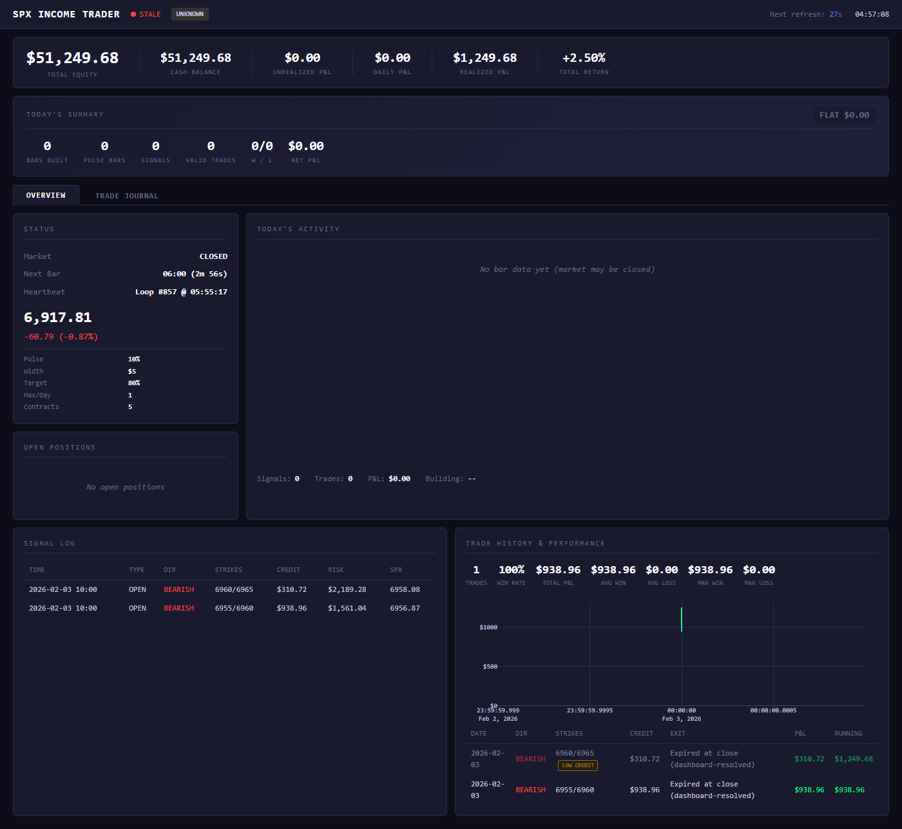
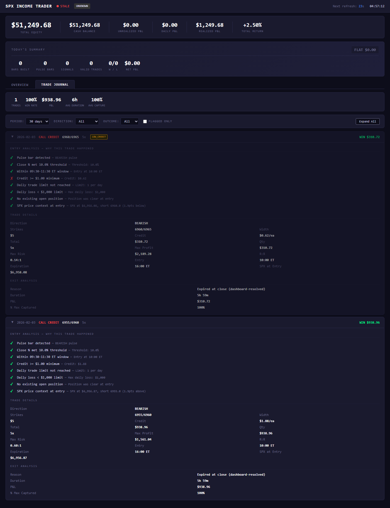

# SPX Income Trader

Fully automated options income system trading SPX 0DTE credit spreads. 100% mechanical strategy execution with zero human intervention, real-time position management, and a native desktop application for monitoring.

Built with Python. Trades live through E*TRADE. Runs as a standalone desktop app on Windows and macOS.

---

## How It Works

The system implements Phil Newton's "Production Line Trading" methodology, a rules-based approach to selling option premium on the S&P 500 index.

1. **Scan** - Monitors 30-minute SPX bars for pulse bar momentum patterns (price closing in the top or bottom 10% of the bar's range)
2. **Confirm** - Waits for the next bar to break the pulse bar's high or low, confirming directional momentum
3. **Execute** - Enters an ATM credit spread ($5 wide, same-day expiration) in the direction of the signal
4. **Manage** - Targets 80% of max profit. At 1:00 PM ET, applies trend-based management rules to decide whether to hold or close early
5. **Repeat** - Resets daily. No overnight exposure on 0DTE positions

The entire pipeline runs autonomously from market open to close. The bot handles strike selection, order sizing, execution, monitoring, and exit management.

---

## Features

**Strategy Engine**
- Four parallel strategies: Daily Income (core 0DTE), Tag 'n Turn (swing), B&B (overnight signals), ORB (opening range breakout)
- Pulse bar detection with configurable thresholds
- Bollinger Band filtering for trend context
- 1:00 PM automated position management based on trending vs non-trending market conditions

**Risk Management**
- Dynamic position sizing via percent_risk method (scales with account growth)
- 2% daily loss circuit breaker halts new entries automatically
- Credit quality gates reject low-premium setups
- Max position limits enforced across all strategies
- PDT rule compliance tracking

**Broker Integration**
- Full E*TRADE API integration: OAuth flow, token auto-renewal (90-min cycle), order preview/place/confirm pipeline
- Reactive 401 handling with automatic token refresh and retry
- Proactive token freshness checks before order placement
- Rate limit (429) protection with exponential backoff
- Dry-run mode for paper trading with real market data and simulated fills

**Dashboard**
- Real-time web UI with account summary, candlestick charts, and position monitoring
- Signal log showing every detected setup with strikes, credit, risk, and SPX price
- Trade journal with entry analysis (pulse bar checklist), market context, and exit review
- Filterable by strategy, direction, outcome, and date range
- Hot-reloadable settings (strategy parameters, trading mode, credentials)
- CSV export for offline analysis

**Desktop Application**
- Native window via pywebview (not a browser wrapper)
- System tray with minimize-to-tray support
- Available for Windows (PyInstaller) and macOS (py2app)
- Headless mode for running without a UI

**Data & Storage**
- SQLite database with WAL mode for concurrent read/write access
- OS keychain credential storage (Windows Credential Manager / macOS Keychain)
- Automatic database migrations on startup
- Signal log rotation at 5,000 entries

---

## Screenshots

| Dashboard Overview | Trade Journal |
|---|---|
|  |  |

The Overview tab shows bot status, SPX price, strategy parameters, open positions, signal log, and trade history with a P&L chart. The Trade Journal provides detailed entry analysis with a checklist of every gate the signal passed through, trade details (strikes, credit, risk/reward, duration), and exit analysis.

---

## Architecture

```
Market Data (Yahoo Finance)
    |
    v
BarBuilder (30-min aggregation)
    |
    v
Strategy Engine
    |--- Daily Income (0DTE credit spreads)
    |--- Tag 'n Turn (BB mean reversion, 3-7 DTE)
    |--- B&B (overnight signal -> morning entry)
    |--- ORB (opening range breakout)
    |
    v
Portfolio Manager (position limits, risk gates, circuit breaker)
    |
    v
Broker Interface
    |--- E*TRADE Broker (live orders via OAuth API)
    |--- Dry-Run Broker (real data, simulated fills via Black-Scholes)
    |
    v
Position Manager (P&L tracking, exit management, 1pm check)
    |
    v
SQLite Database + Flask Dashboard
```

**Tech stack:** Python, Flask, SQLite, Yahoo Finance, E*TRADE API, pywebview, PyInstaller/py2app

---

## Quick Start

```bash
# Clone and install
git clone https://github.com/your-username/spx-income-trader.git
cd spx-income-trader
pip install -r requirements.txt

# Run in dry-run mode (real market data, simulated execution)
python src/main.py

# Or launch the desktop app
python app_desktop.py

# Pre-built desktop app (if available)
# Windows: dist/SPX Income Trader/SPX Income Trader.exe
# macOS:   dist/SPX Income Trader.app
```

**Configuration:**
- `config/strategy_params.yaml` for strategy parameters (thresholds, spread width, profit target, timing windows)
- Dashboard Settings page for credentials, trading mode (dry-run/live), and account settings
- Credentials stored in OS keychain, never in files

---

## Project Structure

```
src/
    main.py                  # TradingBot orchestrator and main loop
    core/
        strategy.py          # Daily Income strategy (pulse bar + breakout)
        tag_n_turn.py        # Tag 'n Turn swing strategy (BB reversals)
        bnb_strategy.py      # B&B overnight signal strategy
        orb_strategy.py      # Opening Range Breakout strategy
        portfolio_manager.py # Multi-strategy coordination and risk gates
        position_manager.py  # Trade lifecycle, P&L, exit management
        bar_builder.py       # 30-min bar aggregation from tick data
        pulse_detector.py    # Pulse bar pattern detection
        bollinger_filter.py  # Bollinger Band filter and trend bias
        pdt_tracker.py       # Pattern Day Trader rule tracking
    brokers/
        base.py              # Abstract broker interface
        etrade_broker.py     # E*TRADE live trading (OAuth, orders)
        etrade_auth.py       # E*TRADE OAuth token management
        dry_run_broker.py    # Simulated execution with real data
    models/
        bar.py               # Bar dataclass
        spread.py            # CreditSpread, OptionLeg models
        trade.py             # Trade record, TradeStatus enum
    data/
        yahoo_finance.py     # Real-time SPX/VIX quotes
        market_data.py       # Market data abstraction
    utils/
        app_paths.py         # Cross-platform path resolution
        logging.py           # Structured logging with credential masking
        version.py           # Version management

dashboard/
    app.py                   # Flask REST API and dashboard server
    templates/
        index.html           # Overview + chart + signal log
        settings.html        # Configuration UI
        setup.html           # Initial setup wizard

config/
    strategy_params.yaml     # All strategy and risk parameters
    settings.py              # Environment and path configuration

database/
    db_manager.py            # SQLite operations (WAL mode, migrations)
    schema.sql               # Database schema
    migrations/              # Auto-applied schema migrations

build/
    build_windows.py         # PyInstaller build script
    build_macos.py           # py2app build script

tests/                       # 75 unit tests

app_desktop.py               # Desktop app entry point (pywebview + Flask)
```

---

## Testing

75 unit tests covering:
- Strategy logic (pulse detection, breakout confirmation, setup windows)
- Position management (sizing, P&L calculation, exit triggers)
- Risk gates (circuit breaker, position limits, credit quality)
- PDT compliance tracking
- Bar building and market state management

```bash
python -m pytest tests/ -v
```

The system also supports full dry-run mode for paper trading against live market data. Every signal, trade, and management decision is logged for post-session review.

---

## Dry-Run Results

Initial validation over 5 trading days (Feb 3-10, 2026) on a $50,000 simulated account:

| Metric | Value |
|--------|-------|
| Trading Days | 5 |
| Trades | 4W / 1L |
| Win Rate | 75% |
| Total P&L | +$3,486 |
| Return | +7.4% |

These are simulated results using real-time SPX market data with Black-Scholes modeled option pricing. Live results will differ based on actual fills, slippage, and market conditions.

---

## Disclaimer

This is a personal project built for educational purposes and to demonstrate software engineering and quantitative finance skills. It is not financial advice.

- Options trading involves significant risk of loss, including the possibility of losing more than the initial investment
- Past performance, whether simulated or live, does not guarantee future results
- This software is provided as-is with no warranty
- Always validate thoroughly in dry-run mode before risking real capital

---

## License

MIT License - See [LICENSE](LICENSE) for details.
