# The Daily Melt

  [](https://opensource.org/licenses/MIT)

Automated SPX 0DTE options income trading system. Runs parallel credit spread strategies on the S&P 500 index, autonomously from market open to close, with real-time risk management, a web dashboard, full backtesting, session recording, and multi-broker support (Charles Schwab (live-tested), E\*TRADE, Interactive Brokers, dry-run simulation). Ships as a standalone desktop app for Windows and macOS.

---

## How It Works

1. **Scan** -- Monitors 30-minute SPX bars for pulse bar momentum patterns (price closing in the top or bottom 10% of the bar's range)
2. **Confirm** -- Waits for price to break the pulse bar's high or low, confirming directional momentum
3. **Execute** -- Enters an ATM credit spread ($5 wide, same-day expiration) in the confirmed direction. Partial fills are accepted and tracked at actual quantity; zero fills are rejected.
4. **Manage** -- Targets 80% of max profit. For PDT accounts (under $25k), applies 1 PM ET trend-based management rules to decide hold vs. close
5. **Repeat** -- Resets daily. No overnight exposure on 0DTE positions

The entire pipeline runs autonomously. The bot handles strike selection, order sizing, execution, monitoring, and exit management across all strategies simultaneously.

---

## Strategies

### Core Strategies

#### Daily Income (DI) -- 0DTE
The primary strategy. Detects 30-minute pulse bars during the 9:30-11:30 ET setup window. A pulse bar is one where price closes in the extreme top or bottom 10% of the bar's range, signaling strong directional momentum. After detection, the bot waits for a breakout confirmation (price breaking above the pulse bar high for bullish, below the low for bearish), then enters an ATM credit spread with same-day expiration. A morning bias filter blocks bearish entries on strong up days and bullish entries on strong down days, reducing counter-trend trades. Exits at 80% of max profit, via 1 PM management rules (PDT accounts only), or at expiration. Bollinger Band agreement is tracked as analytics-only metadata on each trade.

#### Tag 'n Turn (TNT) -- Swing
Bollinger Band mean reversion strategy with 3-7 DTE. Uses a state machine: detects when price tags a Bollinger Band (50-period, 2 std dev), waits for a pulse bar confirming reversal, then enters on breakout. Targets the opposite Bollinger Band. Holds up to 7 days. Runs in a separate swing slot alongside the 0DTE strategies.

### Experimental Strategies

These strategies are functional and included in backtesting, but are considered experimental. They may see changes to their entry logic, parameters, or role in future versions.

#### Bed & Breakfast (B&B) -- Directional Confluence
Detects pulse bars in the 3:00-4:00 PM ET window to generate an overnight directional signal. Only the final bar (15:30) creates a definitive signal; if both the 15:00 and 15:30 bars produce pulses in opposite directions, they cancel out. The signal persists overnight and is used the next morning as directional confluence for DI (informational-only, no independent trade entries). If the market gaps more than 0.3% against the signal direction overnight, the signal is automatically invalidated.

#### Opening Range Breakout (ORB)
Uses the first 30-minute bar of the day to define the opening range. Strong signals only: price must close in the top or bottom 10% of the range (weak signals are rejected). A minimum range filter (default 8.0 points) skips narrow, choppy days. When price breaks above the range high or below the range low, a confirmation delay (default 3 minutes) ensures the breakout holds before entry. Managed by DI's exit logic once entered.

### Position Limits
- 2 total position slots: 1 shared 0DTE (DI or ORB) + 1 swing (TNT)
- All strategies share a single daily loss circuit breaker
- DI and ORB share the 0DTE slot (max 1 per day)
- B&B provides directional confluence only (no entries, does not consume a slot)
- TNT uses the swing slot independently (max 1 per day)
- All entry strategies go through the same portfolio risk gates before entry
- Partial fills accepted with actual quantity tracking; zero fills rejected; Slack/Discord notification on partial fills

---

## Features

### Risk Management
- Budget-based position sizing: daily loss budget drives DI contract count, swing strategies use fixed size
- Per-strategy contract caps (daily_contracts for DI, swing_contracts for TNT/ORB)
- Global max contracts hard cap that can never be exceeded by any strategy
- 2% daily loss circuit breaker halts all new entries automatically
- Weekly and monthly drawdown limits with configurable thresholds
- Consecutive-loss circuit breaker with configurable pause duration
- Partial fill handling: accepts partial fills at actual quantity, rejects zero fills, sends notification on partial fills
- Credit quality gates reject low-premium setups
- Max position limits enforced across all strategies (2 total: 1 0DTE + 1 swing)
- PDT rule compliance: tracks day trades in a rolling 5-business-day window, blocks entries when slots exhausted (accounts under $25k). 1 PM trend-based management activates only in PDT mode.
- Morning bias filter: blocks counter-trend entries based on intraday market direction
- VIX regime awareness (low / normal / elevated / high / extreme)
- Win/loss streak tracking with frozen previous-streak display
- Max-profit cap: unrealized P&L is capped at the theoretical maximum (credit received x 100 x quantity), preventing inflated profit calculations from triggering premature exits
- DB write failure cooldown: if the database save fails after a broker order fills, new entries are blocked for 5 minutes (auto-expiring) to prevent untracked positions. Entry path retries 5 times with exponential backoff; exit path retries 3 times before activating cooldown. Discord alert deduplicated to one per cooldown period.
- SPX 5-cent rounding: all spread order prices are rounded to the nearest $0.05 increment per exchange rules

### Broker Integration
- Multi-broker architecture with pluggable broker interface. **Only Charles Schwab has been tested in live trading sessions.** E\*TRADE and IBKR integrations are implemented and pass CI but have not been validated with real money.
- **Charles Schwab** (live-tested): schwab-py integration with OAuth2 authorization, automatic token refresh, and full options order support. Spread order fill prices parsed from the order-level net credit/debit (not averaged individual leg prices). Commission and fee capture from order details.
- **E\*TRADE** (untested live): Full API integration with OAuth flow, token auto-renewal (90-min cycle), order preview/place/confirm pipeline
- **Interactive Brokers** (untested live): ib_insync integration via TWS/IB Gateway. Snapshot market data, options chain discovery via reqSecDefOptParams, BAG combo orders for credit spreads, live/paper trading with automatic port selection. Dashboard connect/disconnect controls.
- **Dry-run mode** (default): Real market data via Yahoo Finance with simulated fills using Black-Scholes pricing. No broker credentials needed.
- **Ask-side position valuation**: All brokers (Schwab, E\*TRADE, IBKR, dry-run, backtest sim) value open positions conservatively -- buy back the short leg at ASK, sell the long leg at BID. This reflects the actual cost to close rather than an optimistic mid-price estimate.
- **Shadow mode** (dry-run only): Read-only Schwab comparison that runs alongside the dry-run broker. Compares simulated fills against live Schwab quotes at entry, exit, and periodically (every 15 min). Logs price divergence, credit divergence, and whether the trade decision would differ. Dashboard panel shows summary stats and recent comparisons. Enable/disable via the Settings sidebar toggle.
- Reactive 401 handling with automatic token refresh and retry on E\*TRADE and Schwab
- Proactive token freshness checks before order placement and at bot startup (resets 7-day refresh token expiry clock)
- Token expiry warning (<48h remaining) included in market-open Discord notification
- Rate limit (429) protection with exponential backoff
- Live account balance polling: dashboard serves real broker equity, cash, and unrealized P&L in live mode with 15-second TTL cache. Cached broker instance prevents consuming single-use Schwab refresh tokens. Falls back to DB-calculated values on failure.

### Fee Tracking
- **Broker P&L reconciliation:** After a trade closes, a background thread fetches Schwab transaction history, matches all 4 spread legs by order ID, and sums `netAmount` fields to get the true broker P&L (net of all embedded fees). Stored as canonical `pnl` (broker net), `gross_pnl` (price-based), and derived `commissions`. Falls back to price-based if fetch fails. Retry with 8s delay + 15s on partial match.
- Commission and fee capture from Schwab order details after fill (entry + exit orders)
- Post-settlement fee backfill at ~4:20 PM ET for expired 0DTE trades via transaction history API
- Dashboard, journal, and Discord notifications display net P&L via `_trade_net_pnl()` helper (detects reconciled vs legacy trades)
- `commissions` and `gross_pnl` columns in trades table with automatic schema migration

### Database Separation
- Dry-run and live trading use separate databases (`trades_dryrun.db` / `trades_live.db`)
- Switching modes shows only trades from that mode
- Backtest results stored in a shared database (mode-independent)
- Schema auto-created on first access for new mode (schema.sql bundled in PyInstaller builds)

### Database Reliability
- WAL mode with `busy_timeout=10000` on bot connections, shorter timeout on dashboard writes to minimize lock hold time
- Pending trade record written before broker order to prevent orphaned trades on crash
- `save_trade_with_retry()` with 5-attempt exponential backoff (0.2s–4s delays) on all critical writes
- Exit path (`update_trade_close`) retries 3 times with backoff before activating cooldown
- Dashboard expire-trade writes use separate short-lived connections to avoid blocking the bot
- `update_daily_stats` failure is non-fatal (logged at WARNING, does not block exit)
- Per-request connection caching in dashboard (Flask `g` + teardown)
- Critical Discord alert when all save retries are exhausted (deduplicated: one alert per cooldown period)
- Singleton instance guard prevents multiple app instances from competing for the same database

### Chart & Visualization
- Real-time SPX candlestick chart with four timeframe toggles: 4h, 1h, 30m, 5m
- 5-minute bar aggregator (display-only, does not feed strategy logic)
- Scrollable price history: 30+ days on 30m, proportionally more on 1h/4h
- TradingView-style chart controls: drag chart area to pan, scroll wheel to zoom, drag x-axis strip to widen/narrow candles, drag y-axis strip to scale height
- Auto y-axis scaling: visible price range fits to the candles currently in view, updates live as you pan or zoom
- Bollinger Bands overlay on 1h and 4h timeframes
- Lazy loading: fetches older bars seamlessly as user scrolls left, no viewport jump
- Historical trade overlays: entry/exit markers and spread zones render across the full scrollable history, not just today
- Pulse bar highlight boxes on detection
- Entry markers: filled circles (green bullish / red bearish) at entry price
- Exit markers: X at exit price with P&L label and connecting line
- Spread visualization: horizontal dashed lines at short/long strikes with tinted fill zone
- Profit zone overlay showing where price needs to stay

### Dashboard
- Real-time web UI with account summary, candlestick charts, and position monitoring
- Layered audio synthesis via Web Audio API: detuned oscillators, ADSR envelopes, biquad filters, and inharmonic bell partials for 8 distinct sounds (market open/close bells, trade entry arpeggio, profit fanfare, loss tone, bar tick, pulse chime, alert). All mutable.
- Visual micro-interactions: button press spring, tab fade-in, P&L glow on value change, position card entrance animation, mute bounce, toggle squeeze, risk bar pulse, LED flash on state change, settings gear rotation, click ripple effect
- DB-backed strategy status LEDs for all four strategies (persists across page refreshes). Disabled strategies show a dark "Off" LED instead of red.
- Signal log showing every detected setup with strikes, credit, risk, and SPX price
- Shadow mode panel (dry-run only): summary stats, recent comparison rows with timestamps, price/credit divergence, and decision-would-differ LED indicators
- Five tabs: Overview, Trade Journal, Analytics, Backtest, Logs (Backtest and Logs hidden when Developer Mode is off)
- Account page with 2-column full-viewport layout: trading mode, broker credentials, Schwab OAuth status, PDT rule protection, FRED API key, notifications, and trading settings (strategies, position sizing, risk controls, experimental toggles including Developer Mode)
- Developer Mode toggle (Account > Trading Settings > EXPERIMENTAL): hides Backtest tab, Logs tab, and Analytics backtest data source dropdown when off, showing only live trading features
- Economic calendar events displayed as color-coded badges on Trade Journal calendar day cells (FOMC, CPI, NFP, GDP, PCE) via live FRED API feed (4-hour cache) with automatic static JSON fallback. Today's upcoming events also shown in the Overview left panel.

### Trade Journal
- Two views: monthly calendar and filterable list, toggled with Calendar/List buttons
- Calendar view shows per-day P&L, trade count, strategy tags, economic event badges (FOMC, CPI, NFP, GDP, PCE), and no-trade reasons
- List view shows per-strategy summary cards (trades, win rate, P&L) and expandable trade rows
- Entry analysis with pulse bar checklist, strike rationale, market context
- Exit review with post-trade notes and performance rating
- Daily journal capturing bars built, pulse bars, signals evaluated, rejections with reasons
- Filterable by strategy, direction, outcome, day type, and date range
- Optimized loading: broad FRED event cache (1-year window, 4h TTL), conditional SPX quote (skipped when no active trades), and frontend day-click cache for instant re-clicks
- CSV export for offline analysis

### Analytics
- Data source selector: view analytics for live trades or any historical backtest run (backtest source hidden when Developer Mode is off)
- Collapsible panels with Expand All / Collapse All toolbar (state persisted in localStorage)
- Disclaimer banners for simulated (backtest) and dry-run data sources
- Sharpe ratio, Sortino ratio, max drawdown, profit factor, expectancy
- Large dollar values auto-abbreviated ($10.2K, $1.5M, $2.3B) in summary cards
- Equity curve and drawdown series charts
- Monthly returns heatmap with yearly totals
- P&L distribution histogram
- Win rate breakdowns: by day of week, by time of day, by VIX regime
- Per-strategy trade breakdown (trades, wins, win rate, total P&L)
- Per-direction breakdown (bullish vs. bearish)
- Rolling win rate chart (7-day, 30-day, 90-day moving averages)
- Risk-adjusted metrics panel: Value at Risk (VaR), CVaR, tail ratio, win/loss streaks
- P&L attribution panel: decomposes trade P&L into theta, delta, vega, and residual components
- Market regime analysis: VIX regime performance, market direction performance, VIX transitions, market neutrality (correlation/beta to SPX)
- Direction drill-down: cross-tabulates market day type x trade direction to investigate regime-specific weaknesses
- BB agreement analysis: compares win rates and P&L for trades where the Bollinger Band filter agreed vs. disagreed with direction
- Trade duration analysis: per-strategy breakdown (DI vs. TNT), winner vs. loser duration comparison, duration distribution chart, win rate by duration bucket
- Execution quality: slippage summary, slippage by time bucket and VIX regime, exit reason breakdown with drill-down
- Portfolio Greeks: real-time delta, gamma, theta, vega exposure via Black-Scholes calculator
- Strategy tear sheet PDF export with monthly, weekly, and custom date range options
- Auto-loads completed backtest results without requiring app restart

### Backtesting
- Historical replay engine supporting all four strategies (DI, TNT, ORB, B&B)
- Strategy selection checkboxes: run any combination of the four strategies
- Automatic SPX and VIX data download from Yahoo Finance
- VIX + time-of-day slippage model (BidAskModel): $0.02/leg base scaled by VIX regime and intraday liquidity
- NYSE half-day calendar: early close days (1 PM ET) handled automatically
- Morning bias filter applied during simulation
- Backtest assumptions panel showing input parameters (date range, capital, strategies, thresholds) and simulation details (slippage model, pricing model, fill assumptions, flagged unusual credits)
- Configurable parameters: pulse threshold, spread width, profit target, min credit, max contracts, slippage, fill quality factor, max daily loss, initial capital
- Position sizing scales with simulated account growth over the backtest period
- Previous runs list with bulk select and delete
- Results auto-populate in the Analytics tab dropdown on completion
- Per-strategy trade breakdown and monthly return heatmaps

### Notifications
- Dynamic webhook list: up to 5 webhooks with per-webhook type (Slack, Discord, generic), URL, and minimum severity level
- Add, remove, reorder, and test individual webhooks from the Account page
- Backward-compatible migration from legacy fixed-section format
- Email and SMS (Twilio) support
- Hot-reloadable: changes take effect without restarting the bot (the only hot-reloadable setting)

### Demo Mode
- Record live trading sessions as JSONL event streams (14 event types)
- Replay recordings at accelerated speed (1x / 5x / 10x / 30x / 60x)
- Pre-built demo scenarios: winning day, losing day, no-setup day
- Dashboard looks identical during replay (same API routes, same UI)
- Play/pause, speed control, seek, and jump-to-next-event controls
- Privacy scrub removes account IDs, tokens, and API keys from recordings

### Session Recording
- Record live trading sessions as JSONL event streams via the backend API
- Recordings saved as JSONL files in `demo_recordings/` with timestamped filenames
- Browse recent recordings with event count and duration metadata
- Load any recording as a demo file for replay
- Recording auto-closes when the bot stops
- **Note:** The dashboard recording UI (floating button on the Overview tab) is currently disabled. The recording backend and API routes remain fully functional and can be triggered programmatically or re-enabled by uncommenting the `rec-float` div in `index.html`.

### Reconciliation
- Compares database trades against broker order fills
- Detects price and quantity mismatches (configurable tolerance)
- Reports matched count, discrepancies, and P&L delta
- On-demand reconciliation trigger from the dashboard
- Available in live mode only (skipped in dry-run and demo modes)

### Observability
- Structured JSON logging with credential masking and UTF-8 encoding on all file handlers
- Prometheus metrics endpoint (`/metrics`) with trade counters, P&L gauges, and latency histograms
- Health endpoint (`/api/health`) for uptime monitoring
- Price feed health monitoring with stale timeout and failure tracking
- Rotating log files with separate error-level log
- Crash log written to `~/spx_crash.log` for desktop app failures
- BaseException handlers at all critical levels (enter_trade, main loop, bot thread) to prevent silent thread death
- ASCII-only log messages enforced by CI tests (prevents Windows cp1252 encoding crashes in PyInstaller windowed mode)

### Desktop Application
- Native window via pywebview (not a browser wrapper)
- System tray with bot status indicator (green = running, red = stopped) and minimize-to-tray
- Windows (PyInstaller) and macOS (py2app) builds
- Headless mode (`--headless`) for running without a UI
- Dev mode (`--dev`) opens in system browser
- Bot start/stop controls from the dashboard and system tray context menu
- Bot crash detection with watchdog thread and notification
- Singleton instance lock: only one app instance can run at a time. Live mode takes priority — a new live instance evicts any running dry-run instance. Lock auto-releases on crash (Windows file lock).

### Discord Notifications
- Bot startup: mode, equity, open positions, ET time
- Market open (9:30 AM ET): SPX price, VIX level and regime, carry-over positions, token expiry warning if <48h remaining
- Market update every 30 minutes (aligned with bar boundaries at :00 and :30 during market hours): SPX price and session change, VIX, session high/low range, bars built, pulse bars detected, open position details (strikes, unrealized P&L, time held), next bar time
- Trade entry: strategy, direction, strikes, credit per contract, total credit, quantity, breakeven, max risk, expiry
- Trade exit: strategy, direction, strikes, net P&L (after commissions), exit reason, hold duration
- End of day summary (deferred to ~4:25 PM ET to include post-settlement fees): trades (W/L), daily/weekly/monthly P&L, SPX close and session range, equity, win rate, streak, open swing positions, no-trade reason with pulse bar count and VIX context
- Circuit breaker alert: loss amount vs limit, halted status
- Short strike breach warning: critical alert when SPX crosses the short strike
- DB write failure alert: critical notification when all save retries are exhausted on a live trade
- Bot stopped: shutdown reason, uptime, trade count
- Watchdog auto-restart: crash reason, restart count
- All channels configurable (Slack, Discord, generic webhook) with per-channel min severity level
- Mode-aware footer on all Discord embeds (DRY RUN / LIVE / DEMO)

### Data & Storage
- SQLite database with WAL mode and `busy_timeout` for concurrent read/write access
- Separate databases for dry-run and live trading modes
- OS keychain credential storage (Windows Credential Manager / macOS Keychain / Linux Secret Service)
- Automatic database migrations on startup (column additions, index creation)
- Signal log rotation at 5,000 entries with atomic writes (tempfile + rename)
- CSRF protection via per-session API token on all state-changing requests
- Settings API allowlist prevents arbitrary key injection
- Sensitive values redacted in API responses

---

## Screenshots

**Full Application** -- Desktop app with 3-column Overview layout: left sidebar (status, strategy LEDs, risk), center candlestick chart with trade overlays, right column (trade history, performance).

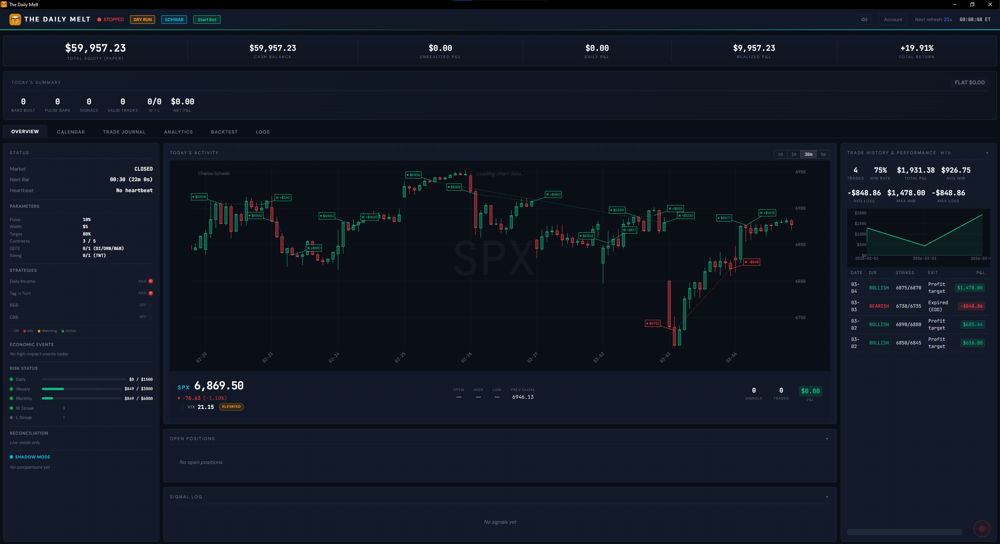

**Dashboard -- 1h Chart with Bollinger Bands** -- One-hour candlestick view with Bollinger Band overlay, historical trade entry/exit markers, and spread visualization across multiple days.

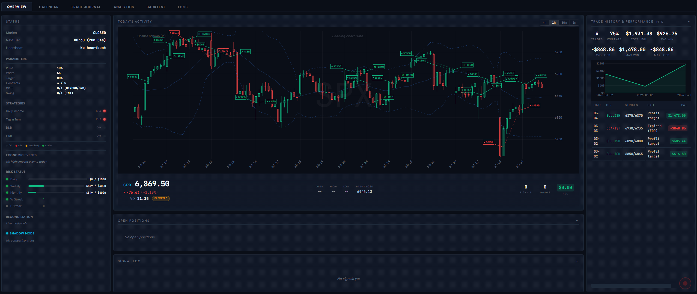

**Open Position** -- Active credit spread details showing strikes, credit received, SPX distance, estimated P&L, time to expiry, and quantity.

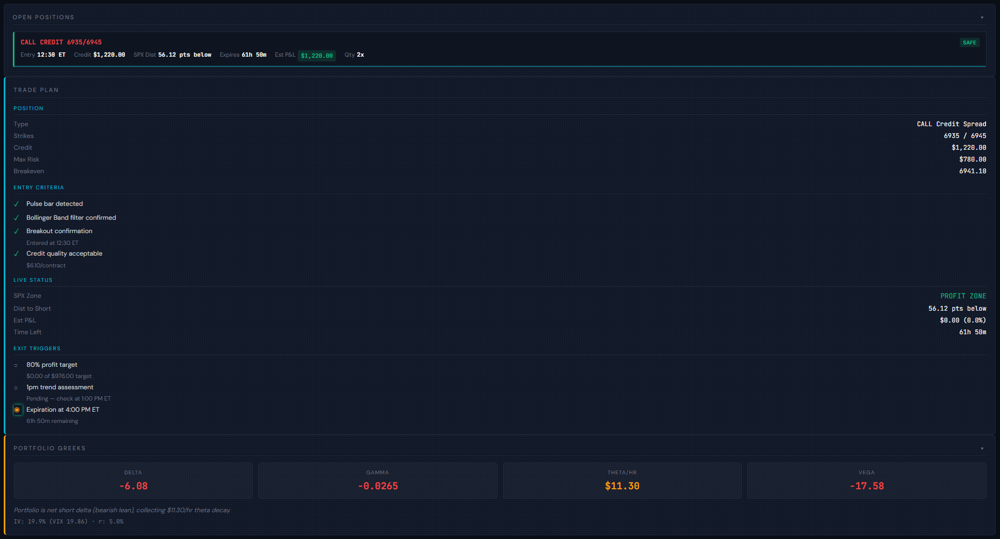

**Account Settings** -- 2-column Account page with trading mode, broker credentials, Schwab OAuth status, PDT rule protection, FRED API key, notification webhooks, and trading settings (strategy toggles, position sizing, risk controls, experimental strategies).

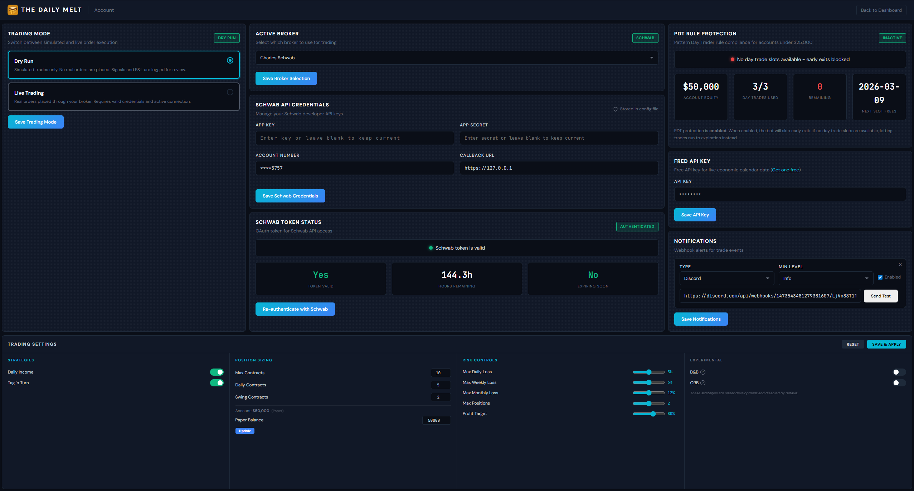

**Trade Journal - Calendar View** -- Monthly calendar showing per-day P&L, trade count, strategy tags, no-trade reasons, weekends, and market holidays. Click any day to expand its trades.

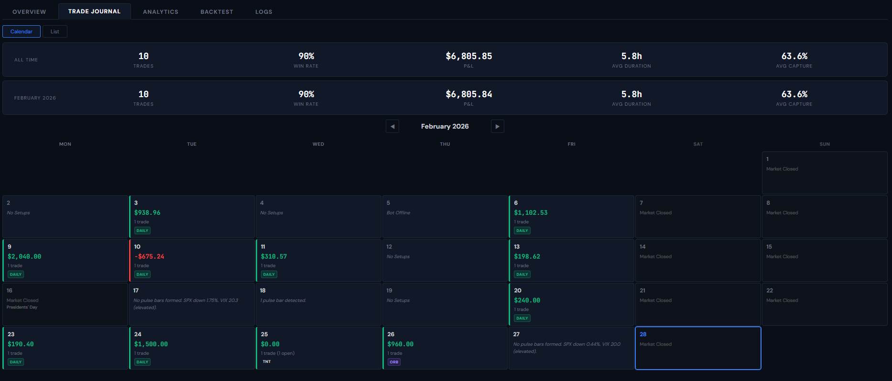

**Trade Journal - List View** -- Per-strategy summary cards, filterable trade list with expandable entry/exit analysis, CSV export.

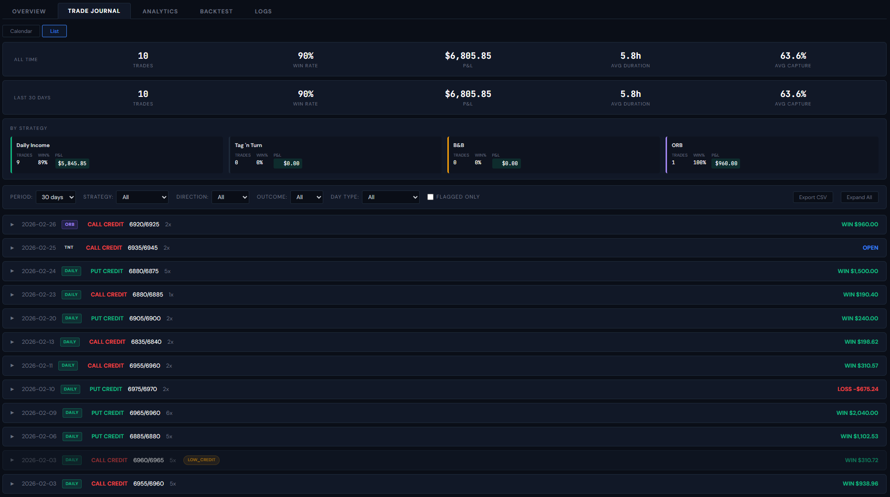

**Trade Journal - Trade Entry Detail** -- Entry analysis with a checklist of every gate the signal passed through, pulse bar details, strike rationale, market context, and trade details.

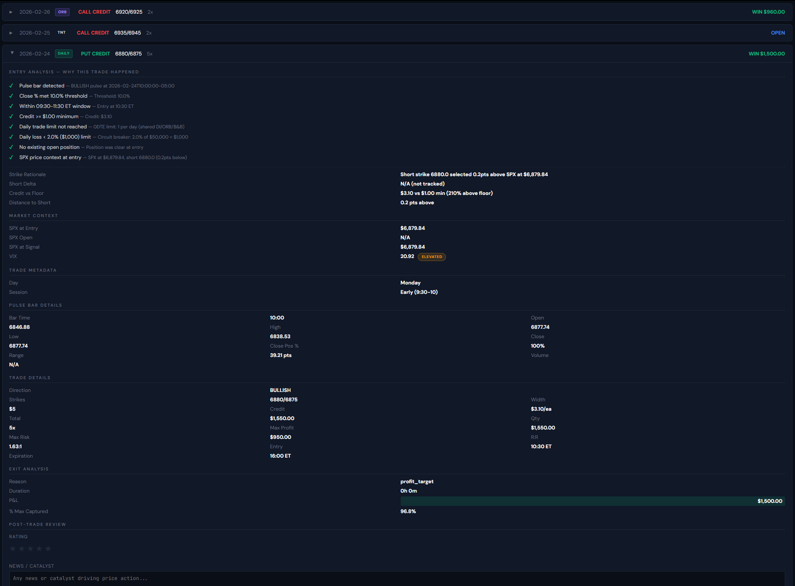

**Trade Journal - Performance Overview** -- Aggregate performance metrics across all journal entries including win rate, P&L breakdown, and trade duration stats.

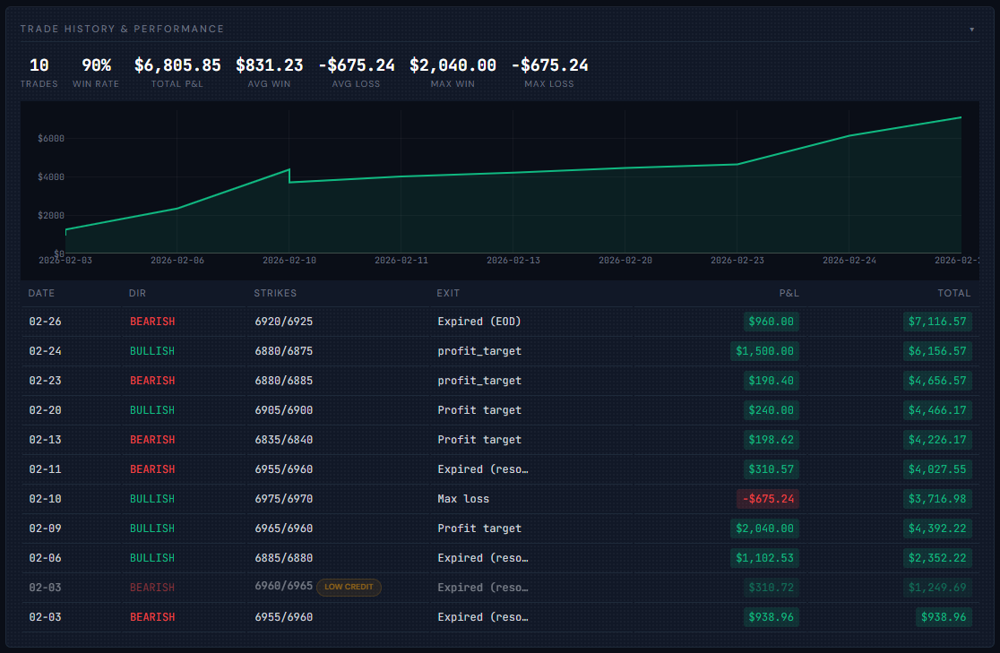

**Backtest -- Full Run (2019-2025)** -- Long-run backtest example showing equity curve and key performance metrics across six years.

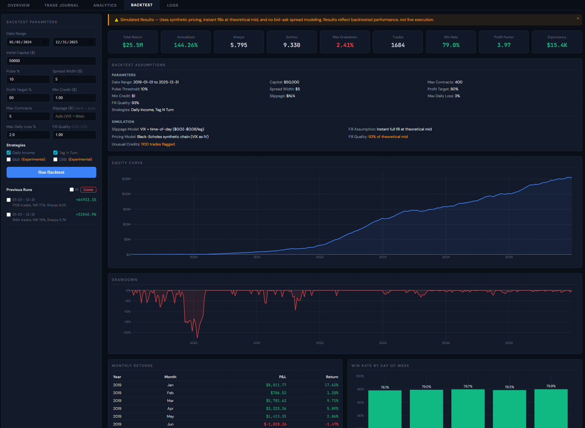

**Analytics -- Equity & Drawdown** -- Equity curve, rolling drawdown chart, and performance summary cards.

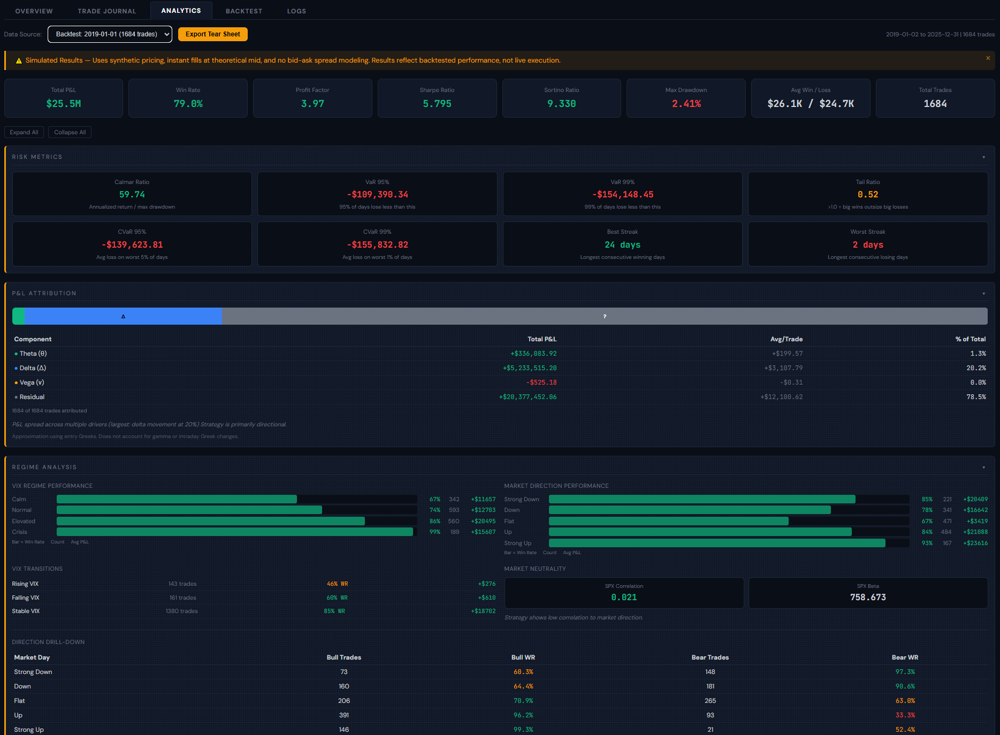

**Analytics -- Regime & Win Rate** -- VIX regime breakdown, market direction drilldown, win rate by day/time/regime, and direction comparison.

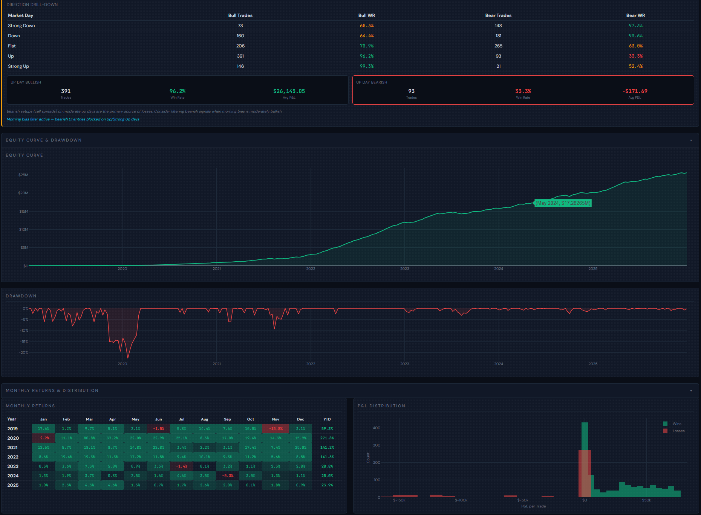

**Analytics -- P&L Attribution & Execution Quality** -- Theta/delta/vega decomposition, slippage analysis by time bucket and VIX regime, and exit reason breakdown.

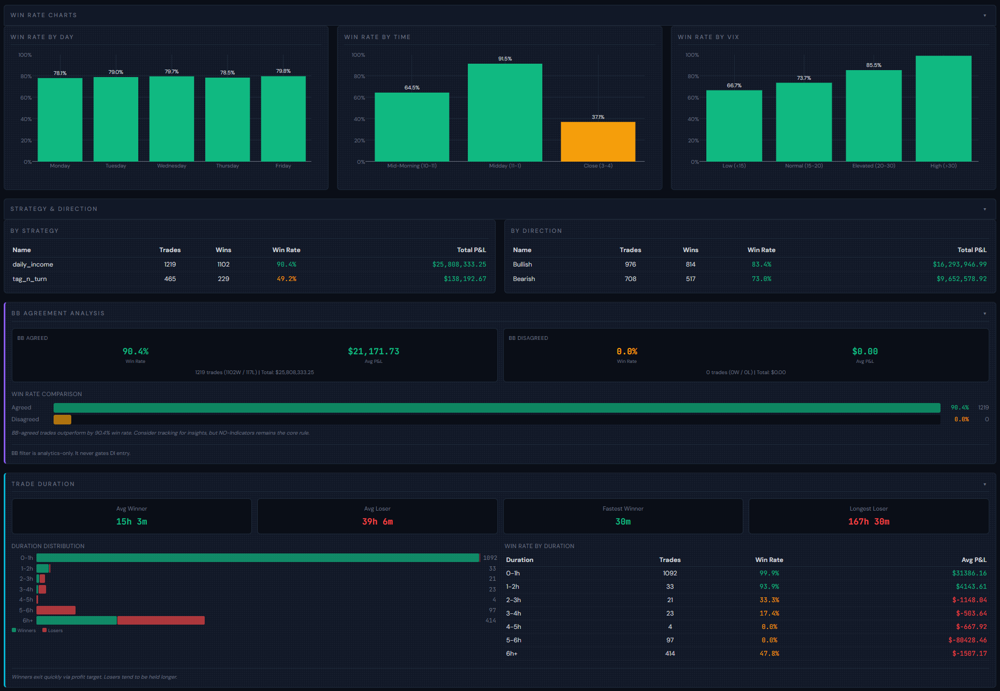

**Analytics -- Risk Metrics** -- Calmar ratio, VaR 95/99, CVaR, tail ratio, win/loss streaks, and rolling win rate windows.

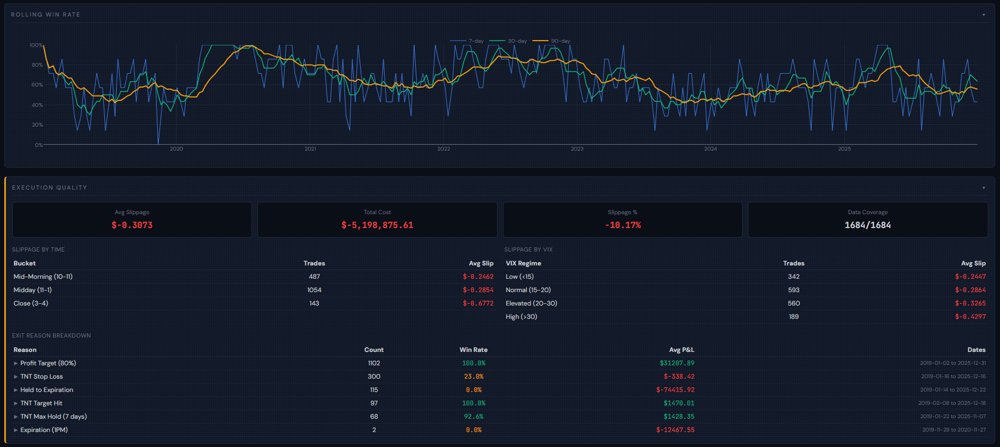

---

## Architecture

```
Market Data
    |--- Yahoo Finance (backtest historical data, dry-run real-time)
    |--- E*TRADE Quotes API (live mode, 10s polling)
    |--- Schwab Quotes API (live mode, 10s polling)
    |--- FRED API (economic calendar release dates, 4h cache)
    |
    v
Price Feed (health monitoring, stale timeout, TTL cache)
    |
    v
BarBuilder (30-min aggregation) + BarAggregator (5-min for charts)
    |
    v
Strategy Engine
    |--- Daily Income (0DTE credit spreads, pulse bar + breakout + morning bias)
    |--- Tag 'n Turn (BB mean reversion, 3-7 DTE swing)
    |--- Bed & Breakfast (directional confluence signal for DI) [experimental]
    |--- Opening Range Breakout (strong-only, range filter, confirmation delay) [experimental]
    |
    v
Portfolio Manager (2-slot limits, risk gates, circuit breaker, PDT gate)
    |
    v
Broker Interface
    |--- Schwab Broker (live-tested, orders via schwab-py OAuth2, fee capture)
    |--- E*TRADE Broker (untested live, orders via OAuth API)
    |--- IBKR Broker (untested live, orders via ib_insync, TWS/Gateway)
    |--- Dry-Run Broker (real data, simulated fills via Black-Scholes)
    |
    v
Position Manager (P&L tracking, exit management, partial fill tracking, PDT-conditional 1pm, DB-failure cooldown)
    |
    +---> SQLite Database (mode-specific: dry-run / live, WAL + busy_timeout, retry-on-lock)
    +---> Flask Dashboard (Overview, Journal, Analytics, Backtest, Logs)
    +---> Notification Manager (Slack, Discord, email, SMS, webhooks)
    +---> Prometheus Metrics (/metrics)
    +---> Event Recorder (session recording, demo JSONL capture)
    +---> Trade Reconciler (DB vs. broker fill comparison)
    +---> Shadow Comparator (dry-run vs. live Schwab price/credit comparison)
```

**Tech stack:** Python 3.13, Flask, SQLite (WAL), Yahoo Finance, E\*TRADE API, schwab-py, ib_insync, pywebview, PyInstaller/py2app, Prometheus | **Notifications:** Discord webhooks, Slack webhooks, generic webhooks, email, SMS | **Testing:** pytest (1,467+ tests), GitHub Actions CI

---

## Settings

All settings are configured via `config/strategy_params.yaml` and the dashboard Account page. Runtime changes (strategy toggles, risk controls, position sizing) are saved to `database/runtime_settings.json` and deep-merged over the YAML defaults on startup. The merge is recursive: nested keys in `runtime_settings.json` override the corresponding YAML keys without clobbering sibling values.

### What requires a restart
- Trading mode (dry-run / live)
- Active broker (schwab / etrade / ibkr / dry_run)

### What is hot-reloadable (no restart needed)
- Strategy enable/disable flags (DI, TNT, B&B, ORB) via Account page Save & Apply
- Pulse threshold, spread width, profit target
- Position sizing parameters (max contracts, risk per trade)
- Drawdown limits (daily, weekly, monthly)
- Notification settings (Slack, Discord, webhooks, email, SMS)

### Key parameters

| Parameter | Default | Description |
|-----------|---------|-------------|
| `strategy.pulse_threshold` | 10% | How extreme the bar close must be (top/bottom N%) |
| `strategy.spread_width` | $5 | Width of credit spreads |
| `strategy.profit_target_pct` | 80% | Exit when this percentage of max profit is reached |
| `portfolio.max_daily_loss_pct` | 2% | Circuit breaker: halt all entries for the day |
| `portfolio.daily_contracts` | 1 | Max contracts for Daily Income (budget-driven cap) |
| `portfolio.swing_contracts` | 1 | Fixed contracts for swing strategies (TNT) |
| `portfolio.max_contracts` | 1 | Global hard cap regardless of account size |
| `timing.morning_start` | 09:30 | Setup window open |
| `timing.morning_end` | 11:30 | Setup window close |
| `di_morning_bias_filter` | true | Block counter-trend entries based on intraday direction |
| `tag_n_turn.spread_width` | $10 | TNT spread width (wider for swing trades) |
| `tag_n_turn.min_dte` / `max_dte` | 3 / 7 | TNT expiration range |
| `orb.min_range_points` | 8.0 | Minimum opening range size in points (skip narrow days) |
| `orb.confirmation_minutes` | 3 | Minutes a breakout must hold before entry |
| `bnb.gap_invalidation_pct` | 0.3% | Overnight gap threshold that invalidates B&B signal |

---

## Quick Start

```bash
# Clone and install
git clone https://github.com/ccharafeddine/spx-income-trader.git
cd spx-income-trader
pip install -r requirements.txt

# Run in dry-run mode (real market data, simulated execution)
python src/main.py

# Or launch the desktop app
python app_desktop.py

# Pre-built desktop app (if available)
# Windows: dist/The Daily Melt/The Daily Melt.exe
# macOS:   dist/The Daily Melt.app
```

**Broker Setup:**

- **Schwab** (live-tested): Launch the app, go to Settings, enter your Schwab API credentials, and complete the OAuth2 flow. The bot handles token refresh automatically. Set `broker.active: schwab` in `strategy_params.yaml`.
- **E\*TRADE** (untested live): Configure your consumer key and secret via the Settings page or OS keychain. OAuth token renewal runs on a 90-minute cycle. Set `broker.active: etrade`.
- **Interactive Brokers** (untested live): Start TWS or IB Gateway with API connections enabled (File > Global Configuration > API > Settings). Configure host, port, and client ID via the Setup page or Settings. Paper trading auto-selects port 7497. Set `broker.active: ibkr`.
- **Dry Run** (default): No broker config needed. Uses real market data with simulated fills.

**Configuration:**
- `config/strategy_params.yaml` for strategy parameters (thresholds, spread width, profit target, timing windows, broker selection, IBKR connection settings)
- Dashboard Account page for credentials, trading mode (dry-run/live), trading settings, notifications, and FRED API key
- Credentials stored in OS keychain, never in config files

---

## Building from Source

Requires **Python 3.13** (pythonnet does not support 3.14+).

**Windows (PyInstaller):**

```bash
py -3.13 -m venv .venv313
.venv313\Scripts\activate
pip install -r requirements.txt

# Build (output: dist/The Daily Melt/)
python build/build_windows.py --clean

# Debug build with console visible
python build/build_windows.py --clean --debug
```

**macOS (py2app):**

```bash
python3.13 -m venv .venv313
source .venv313/bin/activate
pip install -r requirements.txt

# Build (output: dist/The Daily Melt.app)
python build/build_macos.py --clean
```

**Packaged app data paths:**
- Windows: `%LOCALAPPDATA%\SPXIncomeTrader\SPXIncomeTrader\`
- macOS: `~/Library/Application Support/SPXIncomeTrader/`

The packaged app copies the database and seeds `strategy_params.yaml` on first run.

---

## Project Structure

```
src/
    main.py                  # TradingBot orchestrator and main loop
    core/
        strategy.py          # Daily Income strategy (pulse bar + breakout + morning bias)
        tag_n_turn.py        # Tag 'n Turn swing strategy (BB reversals)
        bnb_strategy.py      # B&B directional confluence signal [experimental]
        orb_strategy.py      # Opening Range Breakout strategy [experimental]
        portfolio_manager.py # Multi-strategy coordination and risk gates
        position_manager.py  # Trade lifecycle, P&L, exit management
        bar_builder.py       # 30-min bar aggregation from tick data
        bar_aggregator_5min.py # 5-min bars for dashboard charts (display-only)
        pulse_detector.py    # Pulse bar pattern detection
        bollinger_filter.py  # Bollinger Band filter and trend bias
        pdt_tracker.py       # Pattern Day Trader rule tracking
        drawdown_manager.py  # Drawdown tracking and circuit breakers
        reconciler.py        # Trade reconciliation (DB vs. broker fills)
    data/
        yahoo_finance.py     # Real-time SPX/VIX quotes
        market_data.py       # Market data abstraction
        price_feed.py        # Price feed abstraction with health monitoring
        vix_provider.py      # VIX data with multi-source fallback and regime classification
        economic_calendar.py # FOMC, CPI, and other high-impact event tracking (static JSON)
        fred_calendar.py     # Live FRED economic calendar with caching and static fallback
        sma_provider.py      # Simple moving average calculations
    brokers/
        base.py              # Abstract broker interface
        broker_factory.py    # Broker selection and instantiation
        etrade_broker.py     # E*TRADE live trading (OAuth, orders)
        etrade_auth.py       # E*TRADE OAuth token management
        schwab_broker.py     # Schwab live trading (schwab-py, fee capture) [live-tested]
        schwab_auth.py       # Schwab OAuth2 token management
        ibkr_broker.py       # Interactive Brokers live trading (ib_insync) [untested live]
        dry_run_broker.py    # Simulated execution with real data
    analytics/
        regime_analysis.py   # VIX/direction regime performance and drilldown
        pnl_attribution.py   # Theta/delta/vega P&L decomposition
        greeks.py            # Black-Scholes Greeks calculator
        tear_sheet.py        # PDF strategy tear sheet generator
    backtest/
        engine.py            # Multi-strategy backtest engine
        runner.py            # CLI backtest runner
        data_loader.py       # Yahoo Finance data download and CSV parsing
        sim_broker.py        # Simulated broker for backtesting
        report.py            # Backtest report generation
    shadow/
        comparator.py        # Read-only Schwab comparison for dry-run validation
    demo/
        recorder.py          # JSONL event recorder (live sessions + dashboard recording)
        replay.py            # Replay engine with threaded playback
    models/
        bar.py               # Bar dataclass
        spread.py            # CreditSpread, OptionLeg models
        trade.py             # Trade record, TradeStatus enum
    utils/
        app_paths.py         # Cross-platform path resolution (dev vs. packaged)
        logging.py           # Structured logging with credential masking
        metrics.py           # Prometheus metrics
        notifications.py     # Slack, Discord, email, SMS, webhooks
        market_calendar.py   # NYSE calendar, half-days, holidays
        version.py           # Version management and update check

dashboard/
    app.py                   # Flask REST API and dashboard server (70+ routes)
    templates/
        index.html           # Main dashboard (5 tabs)
        settings.html        # Configuration UI
        setup.html           # Initial setup wizard
    static/                  # Icons and static assets

config/
    strategy_params.yaml     # All strategy and risk parameters
    settings.py              # Environment, paths, DB config, keyring integration, runtime_settings deep merge

database/
    db_manager.py            # SQLite operations (WAL mode, migrations, retry-on-lock)
    schema.sql               # Database schema
    demo_recordings/         # Pre-built and session-recorded demo JSONL files

scripts/
    generate_demo_recording.py  # Fabricate demo scenarios
    run_dashboard.py            # Run dashboard standalone
    run_dry_run.py              # Quick-start dry-run mode
    validate_schwab.py          # Schwab credential validation
    health_check.py             # Health check script
    view_trades.py              # Trade database viewer

build/
    build_windows.py         # PyInstaller build script (Windows)
    build_macos.py           # py2app build script (macOS)

app_desktop.py               # Desktop app entry point (pywebview + Flask + singleton lock)
```

---

## Testing

1,467+ tests covering:
- Strategy logic (pulse detection, breakout confirmation, setup windows, range filters, confirmation delays, morning bias filter, TNT weekend hold prevention)
- Multi-strategy backtest engine (DI, TNT, ORB, B&B parallel execution)
- Position management (sizing, P&L calculation, exit triggers, partial fill tracking)
- Risk gates (circuit breaker, position limits, credit quality, drawdown)
- Catastrophic scenario testing (max_contracts enforcement, B&B entry prevention, circuit breaker all-path coverage)
- PDT compliance tracking, entry gating, and 1PM management integration
- Bar building and market state management
- Consecutive loss tracking and streak counters
- Dashboard win/loss streak counters (end-to-end DB-to-API proof tests)
- Dashboard layout validation (tab structure, panel IDs, history panel title)
- VIX data provider multi-source fallback chains
- Price feed health monitoring and stale detection
- Daily journal persistence and API endpoints
- Notification delivery (Slack, Discord, email, webhook, 30-min market updates, EOD summary, SPX/VIX enrichment)
- Demo mode (recording, replay, Flask integration)
- Session recording (fixed filename mode, start/stop lifecycle, dashboard list/load routes, path traversal protection)
- Trade reconciliation (DB vs. broker comparison, mismatch detection)
- Monitoring and observability (Prometheus metrics, health endpoint)
- Schwab (live-tested), E*TRADE, and IBKR broker integration (connect/disconnect, market data, order execution, position value, ask-side valuation)
- VIX + time-of-day bid-ask spread model (BidAskModel) and fill quality factor
- Slippage tracking and database migrations
- Database separation (dry-run vs live mode)
- Database reliability (save_trade_with_retry, WAL busy_timeout, pending-before-order, DB lock recovery)
- Analytics computations (BB agreement, trade duration, direction drilldown, P&L attribution, regime analysis, execution quality)
- Backtest engine PDT mode and BB agreement tracking
- Chart data endpoints (unified bar history, paginated lazy loading, historical trade queries)
- Timestamp normalization across year boundaries (YYYY-MM-DD HH:MM format, correct sort order)
- Enter-trade resilience (save_trade exception handling, DB cooldown auto-expiry, BaseException re-raise for SystemExit/KeyboardInterrupt)
- FRED calendar service (release standardization, short code mapping, caching, API/static fallback, endpoint structure)
- Production stability guards: AST-based scan for non-ASCII characters in logger calls, UTF-8 encoding on all RotatingFileHandler instances, BaseException handlers in enter_trade/main loop/bot thread, devnull redirect encoding
- Profit target valuation: max-profit cap enforcement, ask-side pricing across all brokers, Schwab spread fill price parsing, chain-based dry-run/backtest pricing, no false immediate profit target triggers
- Fee capture and net P&L accuracy (commission recording, post-settlement backfill, dashboard/journal/notification display)
- Live balance polling (Schwab account balance cache, dry-run guard, failure fallback, cache TTL enforcement)
- EOD expiration ordering (0DTE positions expired before journal finalization)

```bash
python -m pytest tests/ -v
```

CI runs on every push and pull request to `main`, testing Python 3.11, 3.12, and 3.13.

---

## Backtesting

Run backtests from the dashboard Backtest tab or via CLI:

```bash
python -m src.backtest.runner --start 2024-01-01 --end 2025-12-31

# With custom parameters
python -m src.backtest.runner \
    --start 2024-06-01 \
    --end 2025-06-01 \
    --capital 100000 \
    --pulse-threshold 10 \
    --spread-width 5 \
    --profit-target 80 \
    --max-contracts 5 \
    --slippage 0.02 \
    --output docs/backtest_report.md
```

The dashboard Backtest tab provides:
- Strategy selection checkboxes (any combination of DI, TNT, B&B, ORB)
- All parameters configurable in-UI
- Progress bar with current date indicator
- Results display with equity curve, drawdown, and monthly returns
- Backtest assumptions panel with input parameters and simulation details (slippage model, pricing model, fill assumptions, flagged credits)
- Previous runs list with bulk select and delete
- Completed backtests auto-appear in the Analytics tab dropdown
- VIX + time-of-day slippage: $0.02/leg base, scaled by VIX regime (1.0-2.5x) and intraday period (1.0-1.6x)
- Fill quality factor: conservative overlay reducing entry credit (default 1.0, configurable down to stress-test worse fills)
- PDT-aware simulation: 1pm management activates when initial capital < $25k
- Morning bias filter applied during simulation
- BB agreement tracked as analytics metadata on every backtest trade
- Disclaimer banner reminds that backtest results are simulated
- NYSE half-day calendar: early close days handled automatically

SPX and VIX data are downloaded automatically from Yahoo Finance. Pass `--csv` and `--vix-csv` to use existing data files.

---

## Demo Mode

Generate synthetic demo recordings and replay them through the dashboard:

```bash
# Generate all three demo scenarios
python scripts/generate_demo_recording.py --all

# Launch the desktop app in demo mode
python app_desktop.py --demo database/demo_recordings/demo_winning.jsonl
```

Three pre-built scenarios:
- **Winning day**: Bullish pulse, breakout confirmed, put spread entered, 80% profit target hit
- **Losing day**: Bullish pulse, breakout, reversal, stop loss hit
- **No-setup day**: Narrow range, no pulse detected, all windows expire

### Session Recording from the Dashboard

> **Note:** The dashboard recording button is currently disabled. The recording backend remains fully functional — to re-enable the UI, uncomment the `rec-float` div in `dashboard/templates/index.html`.

When enabled, in desktop mode you can record live bot sessions directly from the Overview tab:

1. Start the bot in dry-run or live mode
2. Click **Record** in the Session Recording panel
3. The panel shows a pulsing indicator, elapsed time, and event count
4. Click **Stop** to save the recording
5. Click **Load as Demo** to set it up for replay, then restart with `--demo`

Recordings are saved to `database/demo_recordings/` and can be browsed from the panel. The recording state persists across page refreshes. If the bot stops while recording, the recording is automatically closed and saved.

---

## Expansion Roadmap
- Text message (SMS) notifications via Twilio
- Tastytrade broker integration
- Broker-agnostic shadow comparator: use whichever broker is configured (Schwab or E*TRADE) for shadow quotes instead of hardcoded Schwab
- Rename Logs tab to Developer tab: consolidate logs panel, shadow mode panel, and other diagnostic/builder tools into a single developer-focused tab

---

## Live Validation Log

Live testing began **March 10, 2026** on a Schwab account after dry-run testing for 5 weeks and growing the paper account 20% (from $50,000 to $60,000).

### Requirements for Live Trading

- **Schwab brokerage account** with options spreads enabled (spread trading approval required)
- **Schwab developer account** for API access — provides the App Key and App Secret needed for OAuth2 authentication ([developer.schwab.com](https://developer.schwab.com))
- **FRED API key** (free) for the economic calendar — register at [fred.stlouisfed.org](https://fred.stlouisfed.org) to get a key
- **Discord webhook** (optional) for trade notifications, EOD summaries, and alerts — create a webhook in your Discord server's channel settings
- **Account balance over $25,000 recommended** to avoid Pattern Day Trader (PDT) restrictions. Accounts under $25k are limited to 3 day trades per rolling 5-business-day window; the bot includes PDT protection logic but this constrains trading frequency

### Day 1 — March 10, 2026 (Initial Session)

First live session with conservative 1-contract sizing. Exposed critical issues in position valuation, order response parsing, and database reliability. All issues fixed before Day 2.

**Order execution and valuation fixes:**
- **Spread fill price parsing**: Schwab multi-leg order responses now use the order-level net credit/debit (`price` field) instead of averaging individual leg execution prices, which inflated the apparent entry price
- **Ask-side position valuation**: All brokers now value open spreads conservatively (buy back short at ASK, sell long at BID) instead of using mid-price, which understated the cost to close
- **Max-profit cap**: Unrealized P&L is capped at the theoretical maximum to prevent inflated calculations from triggering premature profit target exits
- **Chain-based dry-run pricing**: Dry-run and backtest brokers now use the options chain with bid/ask spreads instead of intrinsic-only valuation
- **SPX 5-cent rounding**: All spread order prices rounded to nearest $0.05 per exchange rules

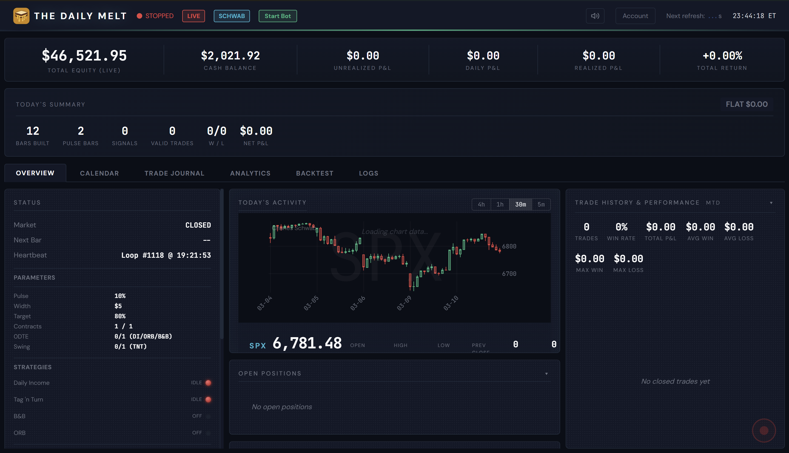

### Day 2 — March 11, 2026 (CPI Day)

**Trade:** Bullish put credit spread 6795/6790 (1 contract), entered 11:01 ET on a bullish pulse bar at 10:30 with 94.3% close position
**VIX:** 25.25 (HIGH regime), SPX opened at 6,790.09
**Result:** Loss — SPX sold off to 6,775.80 (-1.36%), position expired at max loss
**Schwab account impact:** -$337.44
**Strategy assessment:** Clean execution, correct entry per all rules. Loss was directional — market moved against the position on a high-volatility CPI day

**Infrastructure bugs discovered and fixed:**
- **SQLite lock contention (critical):** Flask dashboard holding unclosed connections blocked bot's trade writes, causing live trades to execute on Schwab with no database record. Fixed via `busy_timeout` of 5000ms on all connection sites, retry loop with exponential backoff on `save_trade()`, Flask `teardown_appcontext` cleanup, and a pending-to-active-to-closed lifecycle that writes a DB record before placing any broker order.
- **Schwab client instantiation:** Dashboard was creating a new Schwab client on every API call, consuming single-use refresh tokens and causing token expiration race conditions. Fixed with cached broker singleton.
- **EOD summary timing:** Summary was firing at 4:05 PM before 0DTE settlement. Moved to 4:25 PM post-settlement with commission backfill.
- **Discord notification footer:** Was incorrectly showing "dry-run" in live mode due to `notifier.mode` never being set in the desktop app code path. Fixed.
- **Startup token health checks:** Added proactive token refresh on startup to reset the 7-day clock and immediate `check_token_health()` call to surface expired tokens before the main loop.
- **Full fee capture:** Implemented via Schwab's transaction history API with per-leg fee extraction and net P&L display.
- **Live balance polling:** Dashboard now polls Schwab every 15 seconds with TTL cache for real-time equity, cash, and unrealized P&L.
- **30-minute Discord updates:** Changed from hourly to every 30 minutes aligned with bar boundaries.
- **Daily count filters:** Pending/cancelled records excluded from trade counts to prevent false daily limit blocks after crashes.
- **DB write failure alerting:** CRITICAL Discord notification if trade write fails after all retries.
- **Crash loop prevention:** 5-minute cooldown after DB failure, graceful degradation instead of crash.
- **Post-settlement balance refresh:** Automatic broker balance query at 4:20 PM ET after SPX cash settlement.
- **Dashboard balance fallback logging:** WARNING-level log when live balance fetch fails and falls back to DB-calculated values.

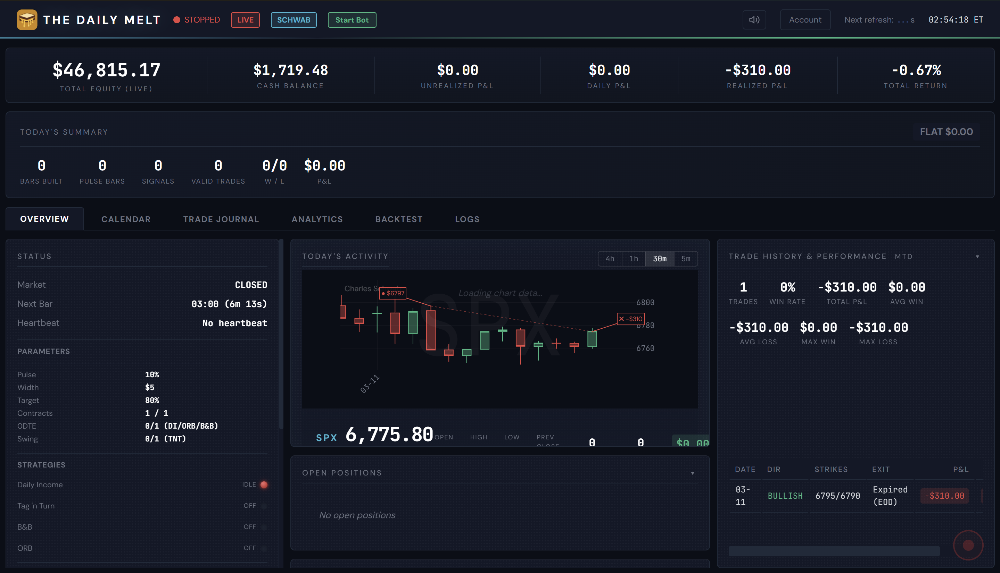

### Day 3 — March 12, 2026

**Trade:** Bearish call credit spread 6690/6695 (1 contract), entered on bearish pulse bar
**Result:** Win — profit target reached at 79% of max profit, closed at 2:50 PM ET after 5h 19m
**Schwab account impact:** +$220.30 (net of fees)
**All infrastructure fixes from Day 2 confirmed working:** trade recorded to database, Discord footer shows "live", no DB lock errors, no crash loops

**Fixes deployed:**
- **Actual fill price capture:** Rewrote `_parse_order_response()` to extract per-leg fills from Schwab's `orderActivityCollection[].executionLegs[]` instead of using the limit order price. Computes real net credit/debit as `abs(avg_sell - avg_buy)` from execution legs with `[FILL QUALITY]` logging of limit-vs-actual diff.
- **Per-leg fee capture:** Extracts `commission`, `fees`, and `miscFees` from each execution leg for accurate net P&L.
- **Net P&L display:** Dashboard trade history and aggregate stats (total P&L, win rate, avg/max win/loss) now show net P&L (gross minus commissions) instead of gross.
- **Cash balance from Schwab:** Dashboard Cash Balance now uses `cashBalance` from Schwab API instead of showing total equity.
- **Instance lock zombie fix:** `shutdown()` now calls `os._exit(1)` if the bot thread doesn't exit within 10 seconds, preventing zombie processes where the watchdog crash-loops and spams Discord.
- **Stale process termination:** On Windows, `_acquire_instance_lock()` now attempts `taskkill /F` on stale processes before raising a lock conflict error.
- **Lock conflict Discord notification:** When `BotAlreadyRunningError` is caught in desktop mode, a "Instance Lock Conflict" notification is sent to Discord so the user knows another instance was detected.
- **DB trade records corrected:** Updated March 11 and March 12 trades with actual Schwab fill data (commissions, actual credit received, slippage).

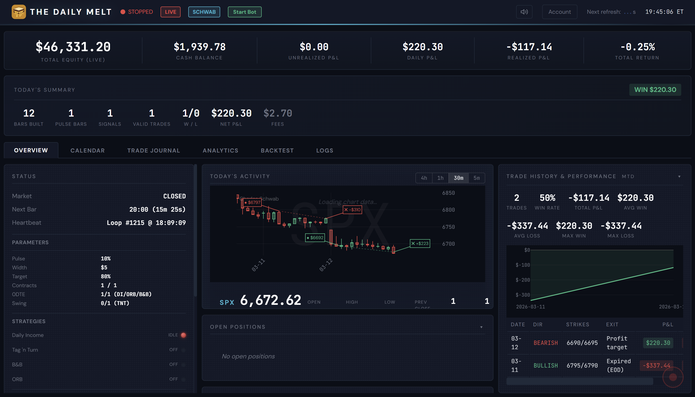

### Day 4 — March 13, 2026

**Trade:** Bearish call credit spread 6660/6665 (2 contracts), entered 11:01 ET on bearish pulse bar at 10:30
**VIX:** 26.34 (HIGH regime), SPX opened at 6,673.49 (-0.99% gap down)
**Result:** Win — profit target reached at 82% of max profit, closed at 3:22 PM ET after 4h 21m
**Schwab account impact:** +$410.42 (net of fees)
**First 2-contract trade:** Budget-based sizing scaled up from 1 to 2 contracts based on account equity and daily loss budget

**Fixes deployed:**
- **Broker P&L reconciliation:** After a trade closes, a background thread fetches Schwab transaction history, matches all 4 legs by order ID, and sums `netAmount` fields (which include embedded fees) to get the true broker P&L. Stores as canonical `pnl` (broker net), `gross_pnl` (price-based), and derived `commissions = gross_pnl - broker_pnl`. Falls back to price-based P&L if fetch fails or fewer than 4 legs match. Retry logic: 8s initial delay + 15s retry on partial match. Added `gross_pnl REAL` column to schema with automatic migration.
- **Unified net P&L helper:** `_trade_net_pnl()` detects reconciled trades (`gross_pnl IS NOT NULL` means `pnl` is already broker net) vs legacy trades (subtracts commissions). All 7 downstream consumers updated: account bar, daily realized, today summary, analytics aggregates, running totals, journal entries, exit analysis.
- **Calendar bug fix:** Journal calendar was showing today's closed trades as open because it queried raw DB status without resolving expired trades. Added `_resolve_expired_trade()` call in the calendar endpoint, matching the list view's `classify_trades()` logic.
- **Strategy state DST fix:** "WINDOW CLOSED" was showing during the active trading window because the frontend computed ET time with a hardcoded EST (UTC-5) offset, ignoring daylight saving time (EDT = UTC-4 since March 8). Moved the trading window check to the backend using Python's timezone-aware `datetime.now(ET)` which handles DST correctly. Also fixed the same bug for ORB's pre-market window.
- **Live data directory discovery:** Diagnosed that the compiled exe writes to `AppData\Local\SPXIncomeTrader\` (via platformdirs) while the project root `database/trades_live.db` is a stale copy. All 3 live trades (Mar 11-13) were correctly recorded in the platformdirs DB. Backfilled `gross_pnl` column and reconciled all trade records with broker net P&L.
- **Dashboard layout overhaul:** Reorganized the Overview tab so all critical data is immediately visible without scrolling. Risk Status, live price data, and open positions are now front and center. Today's Summary panel was condensed, and the Parameters section in the left panel was optimized for space.

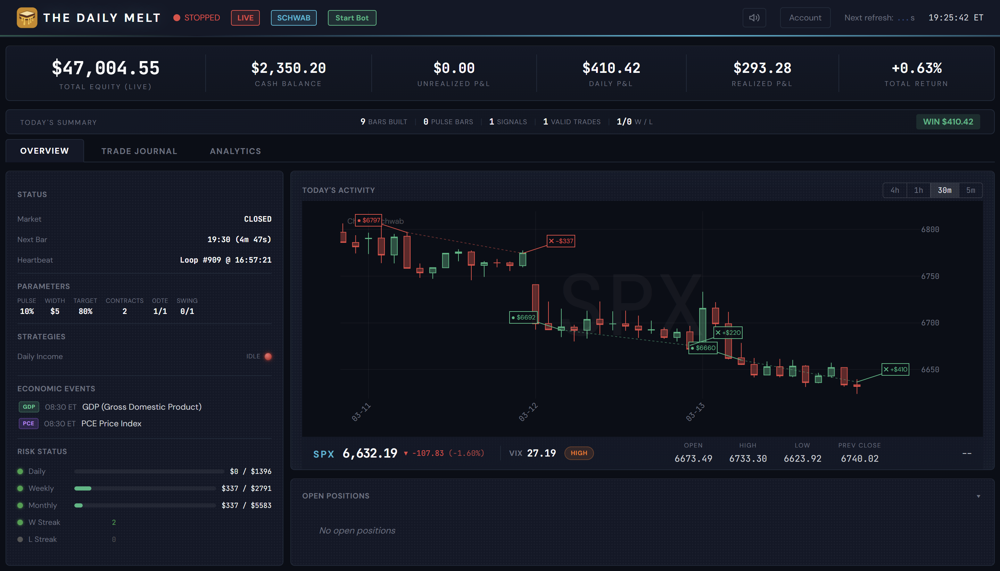

---

### Day 5 — March 16, 2026

**Trade:** Bullish put credit spread 6720/6715 (4 contracts), entered 10:03 ET on bullish pulse bar at 9:30
**VIX:** 24.10 (ELEVATED regime), SPX opened at 6,674.37 (-1.79% gap down), rallied to 6,717.99 at entry
**Result:** Loss — expired at max loss. SPX fell back through both strikes, closing at 6,699.38. Trade was underwater most of the day with no recovery opportunity.
**Schwab account impact:** -$1,180.00
**First 4-contract trade:** Budget-based sizing scaled up from 2 to 4 contracts based on account equity and daily loss budget

**Fixes deployed:**
- **Schwab real-time price feed:** Dashboard now pulls SPX price directly from Schwab (5-second cache) instead of Yahoo Finance (which was 15-min delayed). Yahoo remains as a fallback if Schwab is unavailable.
- **Faster dashboard updates:** Full refresh interval reduced from 30s to 15s. Added a dedicated price ticker that polls every 5 seconds with flash animation on price changes.
- **Live mark-to-market P&L:** Open positions now show real-time P&L calculated from the Schwab option chain using ask-side pricing (same conservative method the bot uses). Labeled "P&L (Live)" when using real prices vs "Est P&L" when falling back to intrinsic math.
- **Manual close button:** Added a "Close Position" button on open position cards. Places a close order at mid-price through Schwab with full post-close processing — exit context (SPX/VIX at exit, time in trade, profit captured %), fee capture, background P&L reconciliation, daily stats update, and Discord notification. Matches the bot's own `_exit_trade()` flow.
- **External close detection:** Bot now syncs with dashboard-initiated closes. Each monitoring cycle checks if any in-memory open trade was closed externally (via DB status), and removes it from active monitoring to prevent duplicate close attempts.
- **Broker P&L reconciliation for expirations:** Fixed reconciliation worker to handle expired trades that have no exit order. Detects expirations (no `exit_order_id`), uses only 2 entry legs + deterministic SPX cash settlement to compute broker P&L and commissions.

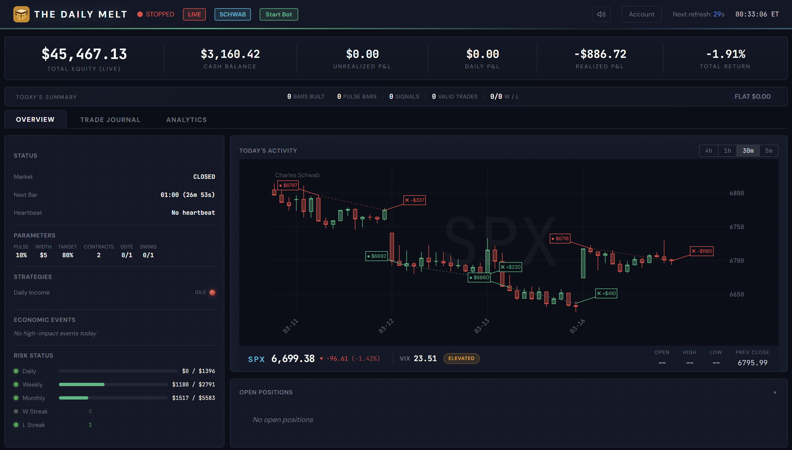

---

### Day 6 — March 17, 2026

**Trade:** None — no pulse bars formed during the morning window
**VIX:** 22.37 (ELEVATED regime), SPX opened at 6,722.35 (-0.96%), ranged 6,711–6,754
**Result:** Flat day. Bot ran all session (1,398 loops), built 12 bars, detected 1 pulse bar but no confirmation signal triggered.

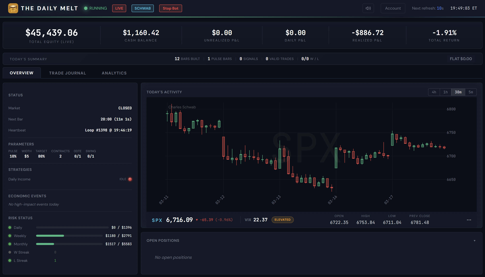

---

### Day 7 — March 18, 2026 (FOMC Day)

**Trade:** Bearish call credit spread 6665/6670 (3 contracts), entered 10:43 ET on bearish pulse bar at 10:00
**VIX:** 23.64 (ELEVATED regime), SPX opened at 6,695.16 (-1.16% gap down), fell to 6,667.01 at entry
**Result:** Win — profit target reached at 82% of max profit ($615 of $750), closed at 3:19 PM ET after 4h 36m. SPX continued selling off into FOMC, closing at 6,642.29 (-1.97%).
**Schwab account impact:** +$615.00
**First 3-contract trade:** Budget-based sizing at 3 contracts. FOMC day — entered before the 2:00 PM rate decision, exited before announcement.

**Fixes deployed:**
- **Chart y-axis scaling:** Fixed chart stretching when open position strike lines are far from current price. Y-axis now scales to candle price action and only includes strikes if within 50% of the visible range.
- **All-time stats refresh:** Trade Journal all-time statistics bar was caching the first load and never updating. Now refreshes on every tab view so newly closed trades are immediately reflected.
- **External close detection:** Bot now checks DB status each monitoring cycle and removes trades closed via the dashboard, preventing duplicate close attempts.

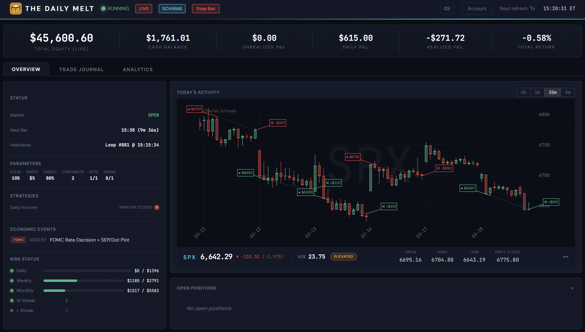

---

### Day 8 — March 19, 2026

**Trade:** Bullish put credit spread 6595/6590 (3 contracts), entered 10:00 ET on bullish pulse bar at 9:30
**VIX:** 26.61 (HIGH regime), SPX opened at 6,583.12 (-1.34% gap down), rallied to 6,595.34 at entry
**Result:** Win — expired OTM at max profit. SPX closed at 6,607.60, comfortably above the 6595 short strike. Trade was underwater mid-day but recovered as SPX bounced off session lows.
**Schwab account impact:** +$630.00
**Back-to-back wins:** 2-trade win streak, bringing the live record to 4W/2L (67% win rate)

**Fixes deployed:**
- **Chart y-axis normalization:** Removed strike line inclusion from y-axis scaling entirely. Chart now scales purely to candle price action — strike lines still render with labels on the right edge but never compress the candles.
- **30m chart today bars:** Fixed live bar source selection that was picking the bot's in-memory bars (only 3 after a mid-day restart) over Yahoo's full 13 bars. Now picks whichever source has the most bars for today.
- **5m chart multi-day history:** Changed from `period='1d'` (today only) to `period='5d'` so the 5-minute chart shows 5 days of history instead of just the current session.

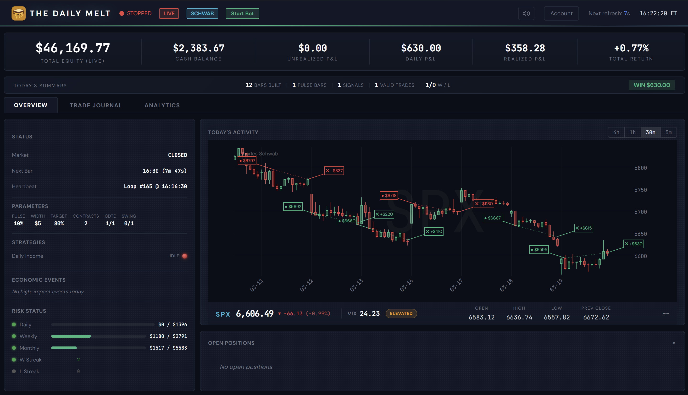

---

### Day 9 — March 20, 2026

**Trade:** Bearish call credit spread 6555/6560 (3 contracts), entered 10:00 ET on bearish pulse bar at 9:30
**VIX:** 24.71 (ELEVATED regime), SPX opened at 6,594.66 (-0.57%), fell to 6,556.00 at entry
**Result:** Win — profit target reached at 83% of max profit ($570 of $690), closed at 2:23 PM ET after 4h 23m. SPX continued trending down to 6,503.51 (-1.94%) — trade captured the move early.
**Schwab account impact:** +$570.00
**3-trade win streak:** Live record now 5W/2L (71% win rate). Total realized P&L turns positive at +$928.28 (pre-reconciliation).

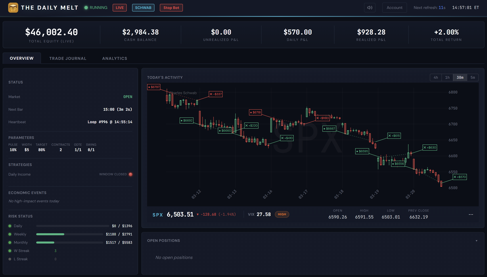

**Test suite:** 1,467+ → 1,507+ tests (+40 new tests covering broker P&L reconciliation, expiration settlement, calendar resolution, LED states)

---

### Day 10 — March 23, 2026

**Trade:** Bullish put credit spread 6630/6625 (3 contracts), entered 10:01 ET on bullish pulse bar at 9:30
**VIX:** 24.75 (ELEVATED regime), SPX gapped up at the open on Trump's Truth Social post claiming Iran negotiations were going well, rallying to 6,629.54 at entry
**Market context:** The gap-up and morning rally were fueled entirely by the Trump post. Iran denied the claims mid-morning and the market reversed hard, selling off throughout the afternoon.
**Result:** Loss — bullish spread entered near the session high as the gap-up rally peaked. SPX reversed and sold off to 6,566.83 low, closing at 6,581.00 (-1.77%). The 6630 short put went deep ITM and expired for a full loss. Held to expiration — no exit signal triggered.
**Schwab account impact:** -$885.00
**Running record:** 5W/3L (62.5% win rate). Total realized P&L: +$43.28.

**Fixes deployed today:**
- **Cash balance display:** Changed from `cashBalance` (inflated on weekends, includes equity in stocks/ETFs) to `availableFunds` for accurate available cash reporting
- **P&L reconciliation catch-up:** Added startup mechanism that detects trades with missing broker P&L (where Schwab token was expired at close time) and re-fetches transaction data to replace theoretical values with actual broker amounts
- **PowerToys Awake:** Installed to keep the trading machine awake during market hours

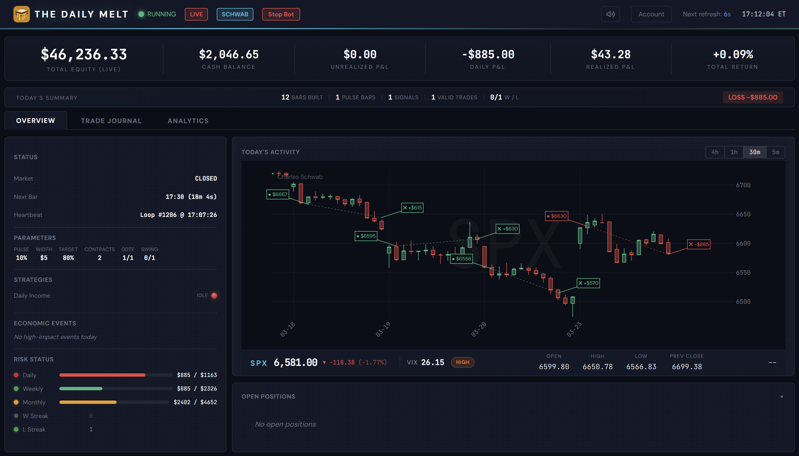

---

### Day 11 — March 24, 2026

**Trade:** No trade — 0 pulse bars detected across 12 bars built during the session
**VIX:** 26.95 (HIGH regime), SPX opened at 6,536.83 and sold off hard, dropping -2.38% to close at 6,556.37. Session high 6,594.80, low 6,526.45.
**Market context:** Continued selling pressure from yesterday's reversal. Steady downtrend all day with no meaningful bounce — the strategy correctly stayed out as no 10%+ pulse bars formed in the choppy, low-conviction price action.
**Running record:** 5W/3L (62.5% win rate). Total realized P&L: +$43.28 (unchanged).

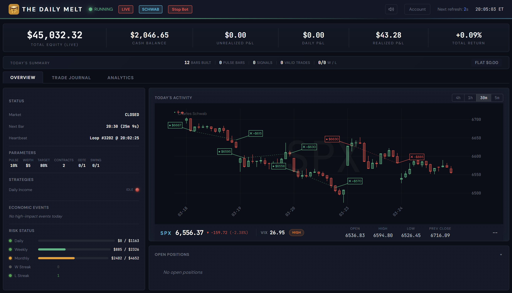

---

### Day 12 — March 25, 2026

**Trade:** Bearish call credit spread 6585/6590 (4 contracts), entered 10:00 ET on bearish pulse bar at 9:30
**VIX:** 25.45 (HIGH regime), SPX opened at 6,620.90 (-0.40% gap down), dropped to 6,583.21 at entry
**Market context:** Ongoing geopolitical uncertainty around potential Iran conflict continued to weigh on sentiment. SPX traded in a narrow range for most of the session, oscillating around the 6585 short strike. Price hovered between profit and loss territory throughout the afternoon with no clear trend resolution.
**Result:** Loss — the bearish spread needed SPX to stay below the 6585 short strike, but price drifted back above it into the close. SPX finished at 6,591.92 (-0.49%), just 7 points above the short strike. Held to expiration with no exit signal triggered. A flat, indecisive day where early momentum failed to predict the final direction.
**Schwab account impact:** -$1,050.00
**Running record:** 5W/4L (55.6% win rate). 2-trade losing streak. Total realized P&L: -$1,006.72.
**Observation:** Three of the four losses have come during elevated geopolitical uncertainty (Iran/Trump news cycle). The strategy's pulse-bar momentum signal may be less predictive when headline-driven reversals dominate intraday price action, though the sample size remains too small for conclusive analysis.

**Fixes deployed today:**
- **Chart y-axis normalization (final fix):** Removed all remaining code that stretched the y-axis to include strike lines, entry/exit markers, or off-screen bars. Y-axis now always scales purely to visible candle data, keeping the chart fully normalized even with open positions.

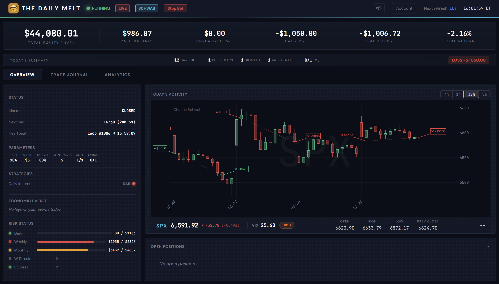

---

### Day 13 — March 26, 2026

**Trade:** No trade — 1 pulse bar detected at 11:00 ET (bearish), but the trigger price of $6,542.24 was never hit before the 11:30 window close. Setup expired.
**VIX:** 27.44 (HIGH regime), SPX opened at 6,539.58 and sold off heavily, dropping -1.96% to close at 6,477.16. Session high 6,573.03, low 6,474.36.
**Market context:** GDP Third Estimate (Q4 2025) released at 08:30 ET. Another strong down day with VIX elevated above 27. The pulse bar formed on the last bar of the morning window — by the time it completed, there wasn't enough time for the trigger to fire before the entry window closed at 11:30.
**Running record:** 5W/4L (55.6% win rate). Total realized P&L: -$1,006.72 (unchanged).

**Fixes deployed today:**
- **Daily risk bar reset:** Fixed stale `portfolio_state.json` from the prior day bleeding into the risk status display — daily risk now resets to $0 at midnight ET
- **Buying power cap:** Position sizing now fetches available buying power from Schwab and caps contracts to what the account can afford, preventing order rejections when cash is low

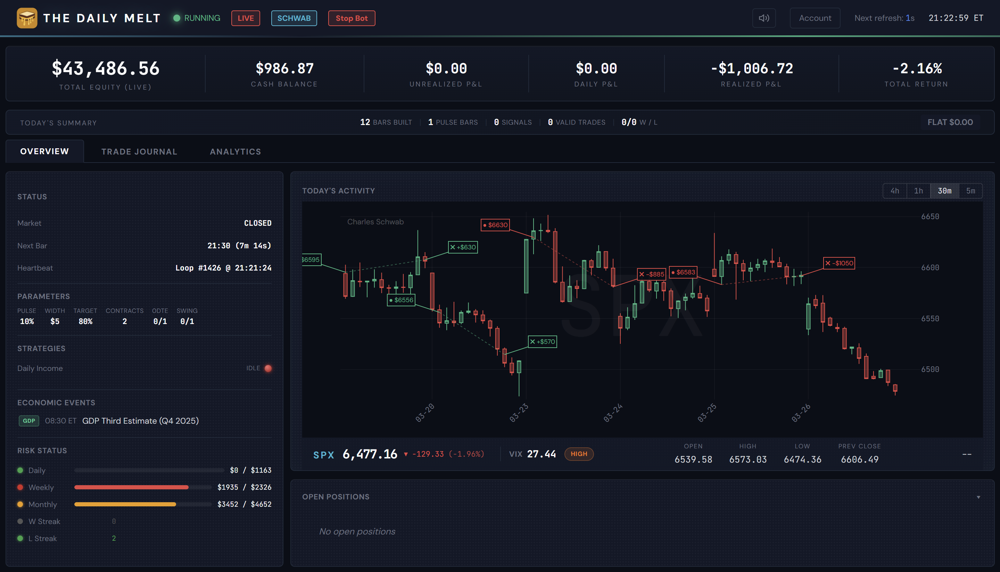

---

### Day 14 — March 27, 2026

**Trade:** No trade — 0 pulse bars detected during the 9:30–11:30 ET setup window.
**VIX:** 31.39 (EXTREME regime), SPX opened at 6,453.89 and sold off steadily, closing at 6,368.85 (-2.12%). Session low 6,356.08.
**Market context:** Markets continued their decline amid ongoing geopolitical uncertainty. VIX pushed above 31, well into extreme territory. No 30-minute bar during the morning window met the 10% pulse threshold — price action was a steady grind lower without the sharp directional bars the strategy looks for. Weekly risk was also nearly filled at $1,935/$2,326.
**Running record:** 5W/4L (55.6% win rate). Total realized P&L: -$1,006.72 (unchanged).

**Fixes deployed today:**
- **Schwab token auto-reload:** When the refresh token expires (400 error, not 401), the cached client is now reset so a fresh token file is picked up on the next API call without requiring a restart
- **P&L reconciliation catch-up:** Added startup mechanism to detect and re-reconcile trades that were missed during token outages (Mar 16–20 had only theoretical P&L)

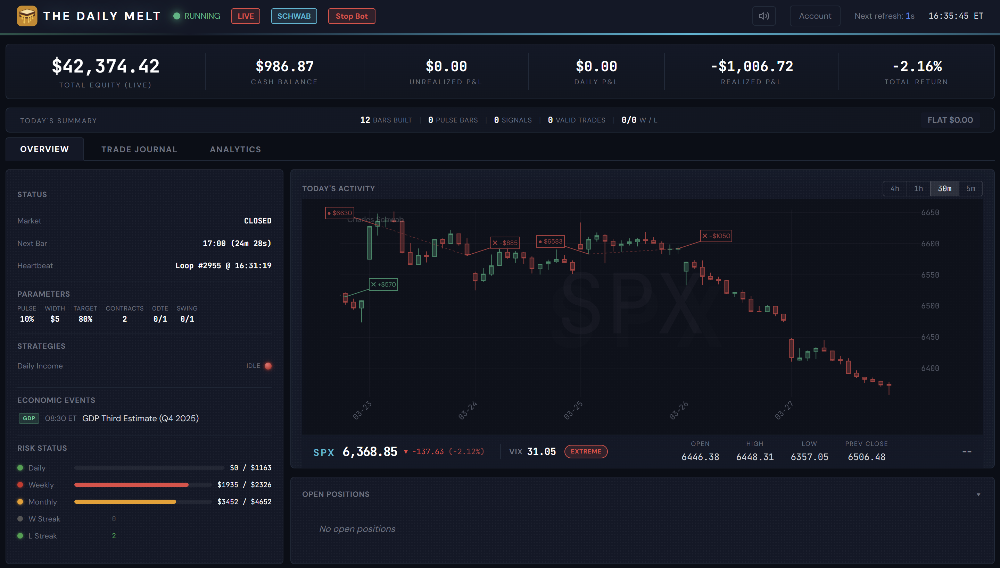

---

### Day 15 — March 30, 2026

**Trade:** Bullish put credit spread 6400/6395 (3 contracts), entered 11:00 ET on bullish pulse bar at 10:00
**VIX:** 30.20 (EXTREME regime), SPX opened at 6,403.37 (-2.70% gap down from Friday's close of 6,581.04). Closed at 6,343.72 (-3.61%).
**Market context:** SPX gapped down hard at the open, then the first 30-minute bar (9:30) registered as a bearish pulse bar — price opened high at 6,427 and dropped to close near the low at 6,373. However, the 10:00 bar reversed sharply, closing at its high of 6,398.82, replacing the pending bearish setup with a new bullish one. The bullish breakout triggered entry at 6,401.09. Price then spent the rest of the day declining steadily, filling the gap and continuing lower. The bullish spread needed SPX above the 6,400 short strike, but it finished at 6,343.72, well below.
**Why the first bar didn't trigger:** The 9:30 bar *was* detected as a bearish pulse bar (H=$6,427.09, L=$6,371.47, C=$6,373.28 — close in the bottom 10%). The entry trigger was set to price below $6,371.47, but before that trigger fired, the 10:00 bar formed a stronger bullish pulse (C=$6,398.82 = H, close at the absolute top of the range), which replaced the pending bearish setup per the strategy's "latest pulse wins" logic.
**Result:** Loss — held to expiration, SPX finished 57 points below the short strike. The morning bounce that created the bullish pulse reversed completely as selling pressure resumed.
**Schwab account impact:** -$855.00
**Running record:** 5W/5L (50.0% win rate). 3-trade losing streak. Total realized P&L: -$1,861.72.
**Observation:** All three consecutive losses share a pattern: morning momentum bars forming during geopolitical uncertainty, then price reversing for the rest of the day. The strategy detects genuine intraday momentum (the pulse bars are real), but in a headline-driven market, that early momentum doesn't carry through to the close. VIX has been in EXTREME territory (30+) for consecutive sessions. This may be a regime where the pulse bar's predictive value is diminished — early moves get faded as traders react to evolving news. Still too early to draw structural conclusions at 10 trades, but the pattern warrants monitoring.

**Fixes deployed today:**
- **Symmetric morning bias filter:** The morning bias filter previously only blocked bearish entries on Up/Strong Up days but allowed bullish entries on Down/Strong Down days unchecked. Now blocks counter-trend entries in both directions — bullish setups are rejected when SPX is trading below the open by 0.25%+ (Down) or 1.0%+ (Strong Down), mirroring the existing bearish-side logic. Note: today's trade at 10:00 ET had SPX only -0.07% from the open (Flat), so it would not have been caught by this filter at the time — the full -3.61% move developed later in the day.

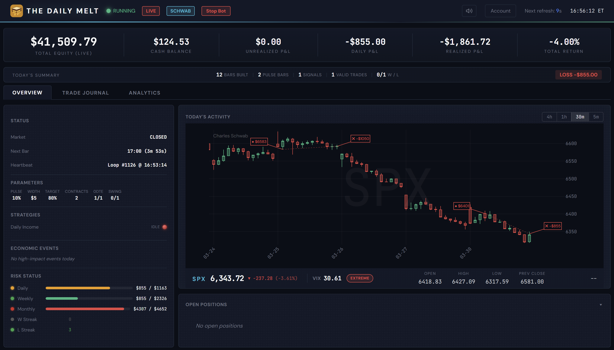

---

### Day 16 — March 31, 2026 (Month End)

**Trade:** No trade — 1 pulse bar detected, 0 signals generated. Monthly risk nearly filled at $4,387/$4,652 (94.3%), which likely prevented any new entries from passing the portfolio risk gate.
**VIX:** 25.25 (HIGH regime), SPX opened at 6,413.69 and closed at 6,528.52 (-0.42%). A recovery day — SPX rallied from the prior week's selloff, gaining back ground from the 6,300s into the 6,500s.
**Market context:** After five consecutive sessions of heavy selling driven by geopolitical uncertainty (Iran/Trump news cycle), the market found a floor and bounced. VIX pulled back from EXTREME (30+) to HIGH (25). The bot detected a pulse bar but the monthly risk budget was nearly exhausted, so no trade was entered.
**Running record:** 5W/5L (50.0% win rate). Total realized P&L: -$1,861.72 (unchanged).

**March 2026 Summary:** 10 trades over 16 trading sessions (bot offline Mar 2–10). 5 wins, 5 losses (50% win rate). Total P&L: -$1,861.72. Average trade duration: 5.3 hours. Average profit capture: -27.3%. The five wins were all bearish trades on trending-down days; the five losses were a mix of bullish and bearish trades on choppy or reversing days. The second half of the month was dominated by geopolitical headline risk (Iran/Trump), which created morning momentum bars that reversed later in the session — a pattern that worked against the pulse bar strategy. Reducing contract size to 2 for April to limit drawdown while the strategy continues to be evaluated.

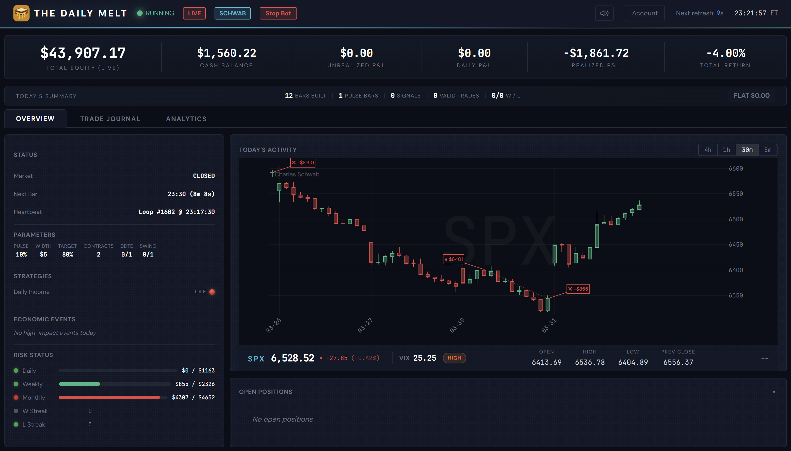

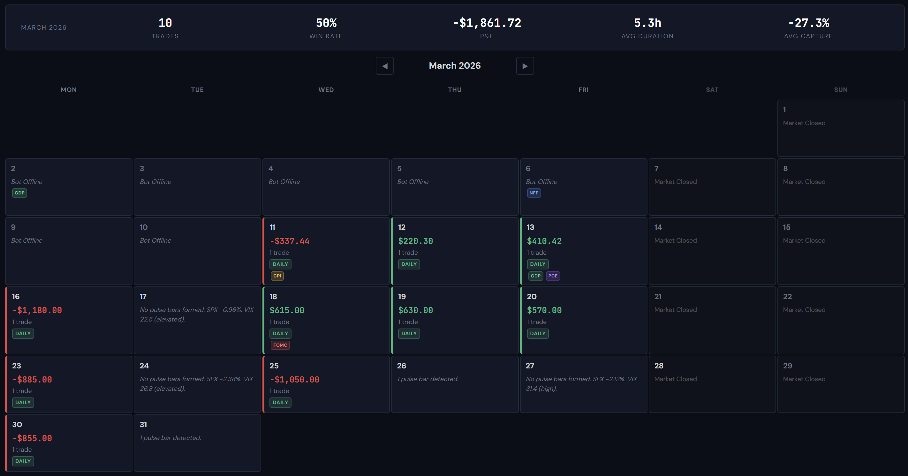

---

### Day 17 — April 1, 2026

**Trade:** Bullish put credit spread 6595/6590 (2 contracts), entered 11:02 ET on bullish pulse bar at 10:30
**VIX:** 24.37 (ELEVATED regime), SPX opened at 6,556.56 (-0.54% gap down). Rallied to 6,609 by mid-morning before fading.
**Market context:** SPX gapped down modestly, then rallied sharply through the morning — the 10:30 bar formed a bullish pulse. Entry triggered at 6,592.57 with SPX +0.55% from the open. Price briefly held above the 6,595 short strike but spent the afternoon drifting lower, closing at 6,575.32 — 20 points below the strike. Another choppy day where morning momentum failed to hold.
**Result:** Loss — held to expiration, SPX finished below the short strike. The intraday rally that created the bullish signal reversed in the second half of the session.
**Schwab account impact:** -$570.00
**Running record:** 5W/6L (45.5% win rate). 4-trade losing streak. Total realized P&L: -$2,431.72.
**Observation:** Four consecutive losses, all following the same pattern: pulse bar detects real morning momentum, but price reverses by the close. Contract size reduced from 2 to 1 for the rest of April to limit further drawdown while evaluating whether this losing streak is a regime-specific issue (elevated VIX, headline-driven markets) or a structural problem with the strategy.

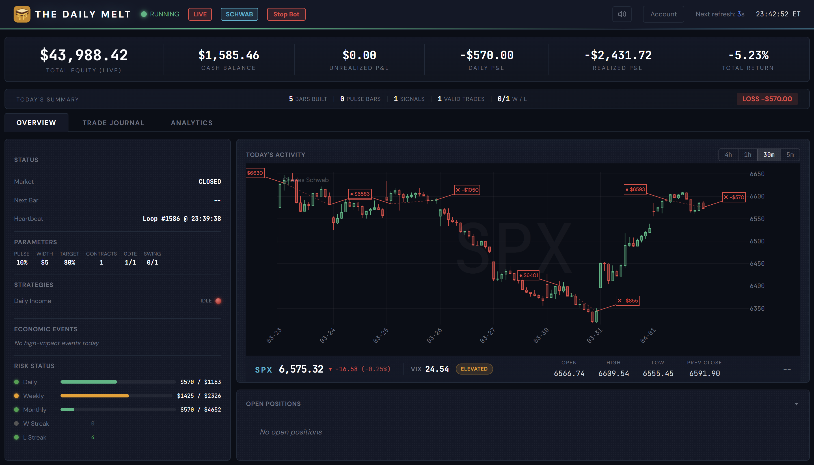

---

### Day 18 — April 2, 2026

**Trade:** Bullish put credit spread 6520/6515 (1 contract), entered 10:01 ET on bullish pulse bar at 9:30
**VIX:** 27.07 (HIGH regime), SPX opened at 6,512.61 (+0.55% gap up from prior close). Closed at 6,582.69 (+1.08%).
**Market context:** Strong gap up at the open followed by a sustained morning rally. The 9:30 bar closed near its high, forming a bullish pulse. Entry triggered at 6,520.59, just above the 6,520 short strike. SPX rallied through the morning, pushing the trade comfortably into profit territory. Profit target hit at 13:14 ET with 81% profit capture — exit at 6,566.44.
**Result:** Win — profit target reached in the afternoon. The trend-following morning momentum held through the session, unlike the prior four losing trades where momentum reversed.
**Schwab account impact:** +$175.00
**Running record:** 6W/6L (50.0% win rate). Losing streak broken at 4. Total realized P&L: -$2,256.72.
**Observation:** First win in over a week. VIX still elevated but starting to compress. The reduced 1-contract size limited upside on this winner (would have been +$350 at 2 contracts), but the primary goal remains capital preservation until a consistent pattern reemerges.

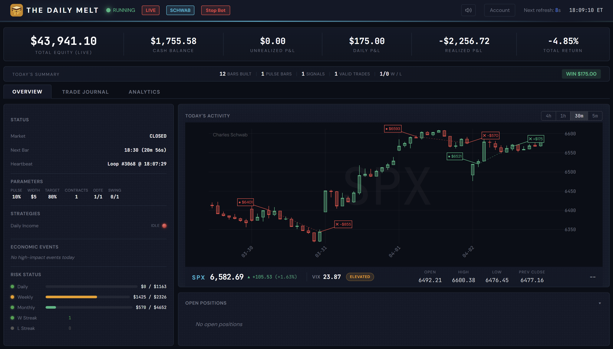

---

### Day 19 — April 3, 2026 (Good Friday — Market Closed)

**Trade:** No trade — US equity markets closed for Good Friday observance.
**Running record:** 6W/6L (50.0% win rate). Total realized P&L: -$2,256.72 (unchanged).

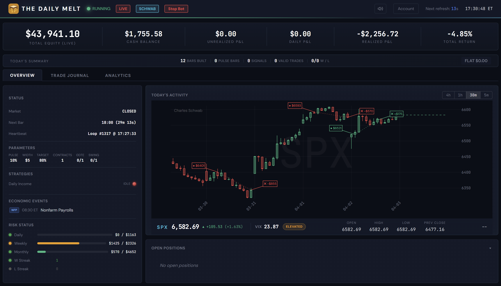

---

### Day 20 — April 6, 2026

**Trade:** No trade — 0 pulse bars detected, 0 signals generated. The Schwab API token had expired over the weekend, so the bot built 0 bars for the entire session despite the market being open.
**VIX:** 24.25 (ELEVATED regime), SPX opened at 6,587.66 and closed at 6,611.83 (+3.82% from prior close). A strong gap-up recovery day following the prior week's selloff.
**Market context:** Markets reopened after Good Friday with a strong gap up. SPX traded in a narrow range (6,587–6,612) after gapping higher. VIX continued to compress from the 30+ levels seen in late March. With the Schwab token expired, no market data was ingested — the bot logged 0 bars built. No screenshot available (token expiration prevented data collection).
**Running record:** 6W/6L (50.0% win rate). Total realized P&L: -$2,256.72 (unchanged).

**Fixes deployed:**
- **Intraday P&L snapshot logging:** New `position_snapshots` table records spread value, P&L, SPX price, and profit capture % every 5 minutes while a position is open. Enables post-trade analysis of how positions evolve intraday.
- **Dashboard balance fallback:** When Schwab token expires, dashboard now falls back to cached `post_settlement_balance.json` instead of computing balance from starting capital + realized P&L (which incorrectly showed cash = equity because it doesn't account for non-options holdings).

---

### Day 21 — April 7, 2026

**Trade:** Bearish call credit spread 6560/6565 (1 contract), entered 10:00 ET on bearish pulse bar at 9:30. Credit received: $2.45.
**VIX:** 26.0 at entry → 26.7 at exit (HIGH regime). SPX opened at 6,601.93 (+4.07% gap up from prior close of 6,343.72).
**Market context:** Massive gap up at the open as markets continued recovering from the prior week's selloff. SPX dropped from the 6,602 open to 6,534 (session low) by mid-morning, triggering a bearish pulse bar at 9:30. Entry at 10:00 with SPX at 6,560.30 (-0.63% from open). However, the selling didn't persist — SPX reversed and rallied steadily through the afternoon, closing at 6,616.85 near the session high. The intraday chart shows a classic V-shaped reversal: sharp morning dip followed by a grind higher for the rest of the day.
**Result:** Loss — held to expiration, SPX closed at 6,616.85, well above the 6,560 short strike. Profit captured: -104.08%. Three additional pulse bars were detected at 10:30, 11:00, and 11:30 but all rejected due to position limit (already in a trade).
**Schwab account impact:** -$255.00
**Running record:** 6W/7L (46.2% win rate). Total realized P&L: -$2,511.72. Total return: -5.40%.
**Observation:** Another morning momentum reversal — the pattern that has plagued the strategy since late March. The bearish signal was legitimate (SPX was -0.63% from the open at entry), but the selling exhausted itself at the 6,534 low and the rest of the day was a steady recovery. Day classified as "choppy" with only +0.23% open-to-close move despite the massive +4.07% gap from prior close. With 13 trades now in the live record, the strategy is running at 46.2% win rate vs the backtested 74%. The elevated VIX / headline-driven environment continues to produce morning momentum that fails to carry through.

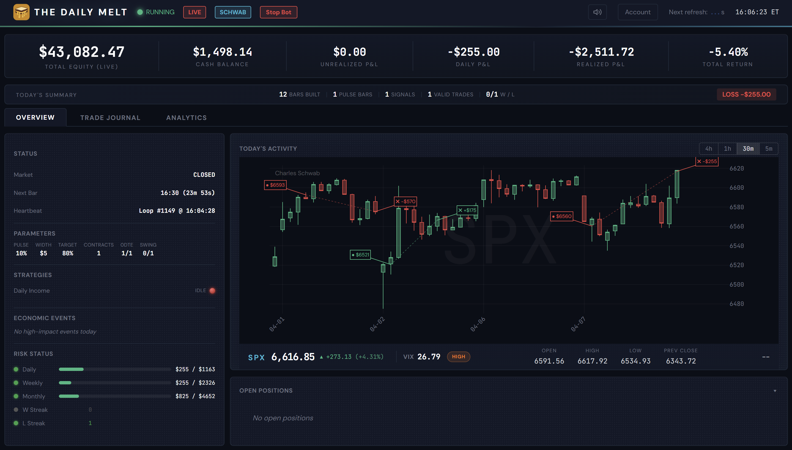

---

### Day 22 — April 8, 2026

**Trade:** Bearish call credit spread (1 contract), entered on bearish pulse bar during the morning window. Credit received: $2.60.
**VIX:** 21.04 (ELEVATED regime), SPX closed at 6,792.81 (+2.66% from prior close of 6,616.85). A massive gap-up continuation day.
**Market context:** SPX gapped up sharply from the prior close and continued rallying throughout the session. The intraday chart shows a steady uptrend with no meaningful pullbacks — candles trended from the low 6,760s to close near 6,793. A bearish pulse bar formed during the morning window, but the selling pressure never materialized. VIX dropped from 26.0 to 21.04, crossing below the HIGH threshold into ELEVATED territory for the first time since mid-March.
**Result:** Loss — held to expiration, SPX closed well above the short call strike. The bearish signal was overwhelmed by the strong continuation rally. This marks the 5th loss in the last 6 trades.
**Schwab account impact:** -$240.00
**Running record:** 6W/8L (42.9% win rate). 3-trade losing streak. Total realized P&L: -$2,751.72. Total return: -5.91%.
**Observation:** VIX compression from HIGH to ELEVATED signals the market may be transitioning out of the headline-driven reversal environment that plagued the strategy in late March/early April. The continued pattern of bearish morning signals failing on strong rally days suggests the strategy's pulse bar signals remain poorly calibrated for this recovery phase.

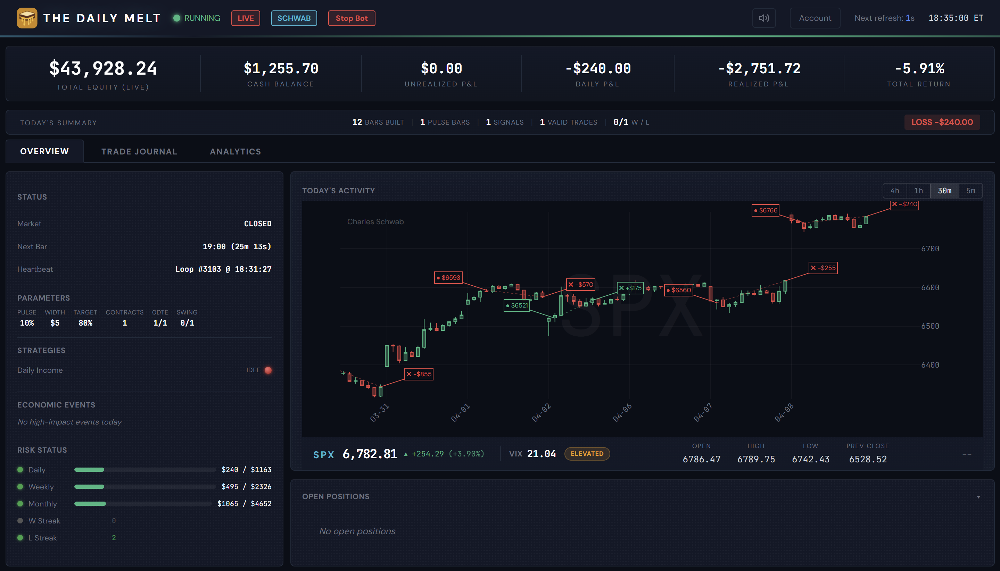

---

### Day 23 — April 9, 2026

**Trade:** Bearish call credit spread (1 contract), entered on bearish pulse bar during the morning window. Credit received: $2.50.
**VIX:** 19.50 (NORMAL regime), SPX closed at 6,824.66 (+0.47% from prior close of 6,792.81). Another grinding up day.
**Market context:** SPX continued its multi-day rally, opening near the prior close and grinding higher throughout the session. The intraday chart shows a steady uptrend similar to the prior day. VIX dropped below 20 for the first time since mid-March, entering NORMAL regime. A bearish pulse bar formed in the morning but the broader trend remained firmly bullish.
**Result:** Loss — held to expiration, SPX closed above the short call strike. The bearish setup failed again as the recovery rally persisted. Fourth consecutive loss.
**Schwab account impact:** -$250.00
**Running record:** 6W/9L (40.0% win rate). 4-trade losing streak. Total realized P&L: -$3,001.72. Total return: -6.45%.
**Observation:** Win rate has dropped to 40%, well below the backtested 74%. VIX returning to NORMAL regime suggests the volatility storm is passing, but the strategy continues generating bearish signals during what has been a sustained multi-day rally. The -$3,001.72 total P&L crosses the psychological -$3k threshold.

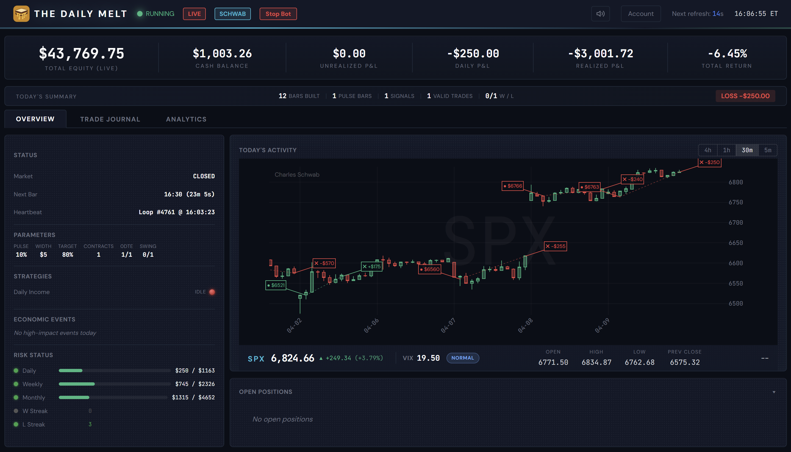

---

### Day 24 — April 10, 2026

**Trade:** Bullish put credit spread (1 contract), entered on bullish pulse bar during the morning window. Credit received: $2.00.
**VIX:** 19.23 (NORMAL regime), SPX closed at 6,816.89 (-0.11% from prior close of 6,824.66). A choppy, range-bound session that drifted lower into the close.
**Market context:** After three strong rally days, SPX opened near the prior close and traded in a choppy range. The morning saw a brief push higher into the 6,840s before reversing and grinding lower through the afternoon, ultimately closing just below the prior day's level. A bullish pulse bar formed during the morning rally, but the momentum faded.
**Result:** Loss — held to expiration, SPX closed below the short put strike. The bullish setup triggered at the morning high, and the subsequent reversal lower pushed the trade to max loss. Fifth consecutive loss — the longest losing streak in the live record.
**Schwab account impact:** -$300.00
**Running record:** 6W/10L (37.5% win rate). 5-trade losing streak. Total realized P&L: -$3,301.72. Total return: -7.18%.
**Observation:** The worst stretch of the live validation period. Five straight losses have pushed the win rate to 37.5%, roughly half the backtested rate. The strategy has now lost on both bearish and bullish signals in the same week — bearish signals fail on rally days, and the one bullish signal caught a reversal. The common thread remains morning momentum failing to carry through the session.

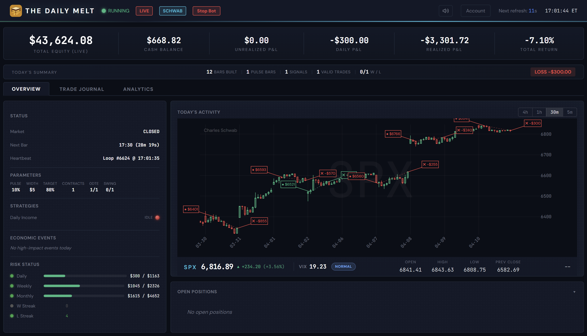

---

### Day 25 — April 13, 2026

**Trade:** Bullish put credit spread (1 contract), entered on bullish pulse bar during the morning window. Credit received: $1.79.
**VIX:** 19.12 (NORMAL regime), SPX closed at 6,880.24 (+0.93% from prior close of 6,816.89). A broad rally day with sustained momentum.
**Market context:** SPX gapped up modestly at the open and continued rallying through the session, closing near the day's high at 6,880. The intraday chart shows a clean uptrend with no significant pullbacks. A bullish pulse bar formed in the morning and the momentum carried through — unlike the prior day's false start. VIX held steady in NORMAL territory around 19.
**Result:** Win — profit target reached. The bullish momentum held through the session, allowing the put credit spread to decay and hit the profit target. Losing streak broken at 5.
**Schwab account impact:** +$145.00
**Running record:** 7W/10L (41.2% win rate). Total realized P&L: -$3,156.72. Total return: -6.79%.
**Observation:** First win since Day 18 (April 2), snapping a brutal 5-trade losing streak. VIX remaining in NORMAL regime and the cleaner price action (no headline-driven reversals) suggest the strategy may perform better in this calmer environment. The reduced credit ($1.79) limited the upside, but capital preservation remains the priority after the drawdown.

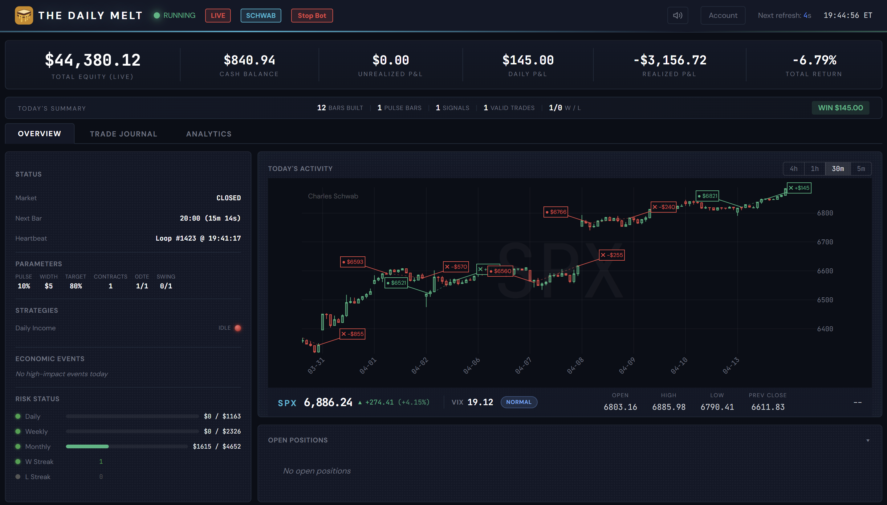

---

### Day 26 — April 14, 2026

**Trade:** No trade — 0 pulse bars detected during the 9:30–11:30 ET setup window despite 12 bars built.
**VIX:** 18.42 (NORMAL regime), SPX opened at 6,910.20 and closed at 6,967.38 (+5.30% from prior close). A massive gap-up rally day.
**Market context:** Markets continued their recovery from the early April selloff with a huge +5.30% move. Despite 12 bars being built and 4 signals evaluated, no pulse bars formed — the rally was a steady grind higher without the sharp directional bars the strategy requires.
**Running record:** 7W/10L (41.2% win rate). Total realized P&L: -$3,156.72 (unchanged).

---

### Days 27–28 — April 15–16, 2026

**Trade:** No trade — no setups detected on either day. Market data was being ingested but no pulse bars formed.
**Running record:** 7W/10L (41.2% win rate). Total realized P&L: -$3,156.72 (unchanged).

---

### Days 29–31 — April 17, 20–21, 2026 (Bot Offline)

**Trade:** No trade — bot was offline for three trading days. The Schwab refresh token expired while the app was unable to run (Windows Smart App Control had blocked the unsigned PyInstaller executable). The token's 7-day TTL lapsed during the downtime. The app was unblocked on April 22 by disabling Smart App Control, and stale lock files from the force-killed process were cleared to allow relaunch.
**Running record:** 7W/10L (41.2% win rate). Total realized P&L: -$3,156.72 (unchanged).

---

### Day 32 — April 22, 2026

**Trade:** Bullish put credit spread 7120/7115 (1 contract), entered 10:00 ET on bullish pulse bar at 9:30. Credit received: $1.95.
**VIX:** 19.09 at entry (NORMAL regime), SPX opened at 7,102.91 (+1.14% gap up from prior close). Closed at 7,137.90 (+1.64% from prior close).
**Market context:** First trading day after the bot came back online with a fresh Schwab token. SPX gapped up modestly and continued higher. The 9:30 bar formed a bullish pulse and the trigger fired at 10:00 with SPX at 7,120.81. Price oscillated through the day — the chart shows a choppy session with a dip to 7,115 mid-afternoon before recovering. Profit target hit at 15:40 ET with 82% profit capture.
**Result:** Win — profit target reached ($160 vs $156 target). SPX at exit: 7,128.48. Day classified as "choppy" with only +0.36% open-to-close.
**Schwab account impact:** +$160.00
**Running record:** 8W/10L (44.4% win rate). Total realized P&L: -$2,996.72. Total return: -6.44%.
**Observation:** Clean win on the first day back. VIX solidly in NORMAL territory for the first time since mid-March. The reduced volatility environment seems more favorable for the strategy's pulse bar signals.

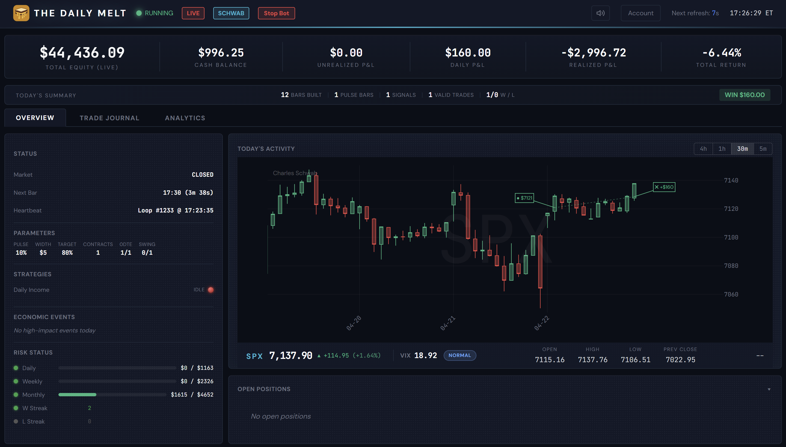

---

### Day 33 — April 23, 2026

**Trade:** No trade — 0 pulse bars detected. 12 bars built, 4 signals evaluated, but none qualified.
**VIX:** 19.45 (NORMAL regime), SPX opened at 7,118.80 and closed at 7,108.40 (+0.95% from prior close).
**Running record:** 8W/10L (44.4% win rate). Total realized P&L: -$2,996.72 (unchanged).

---

### Day 34 — April 24, 2026

**Trade:** No trade — 0 bars built, 0 signals. The Schwab refresh token had expired again (the token refreshed on April 22 only had a 7-day TTL, and the underlying auth may not have fully persisted). With no market data ingested, the bot could not detect any setups. Discord 30-minute status updates also failed for the same reason.
**VIX:** 18.57 (NORMAL regime), SPX opened at 7,136.48 and closed at 7,165.08 (+0.55% from prior close).
**Running record:** 8W/10L (44.4% win rate). Total realized P&L: -$2,996.72 (unchanged).

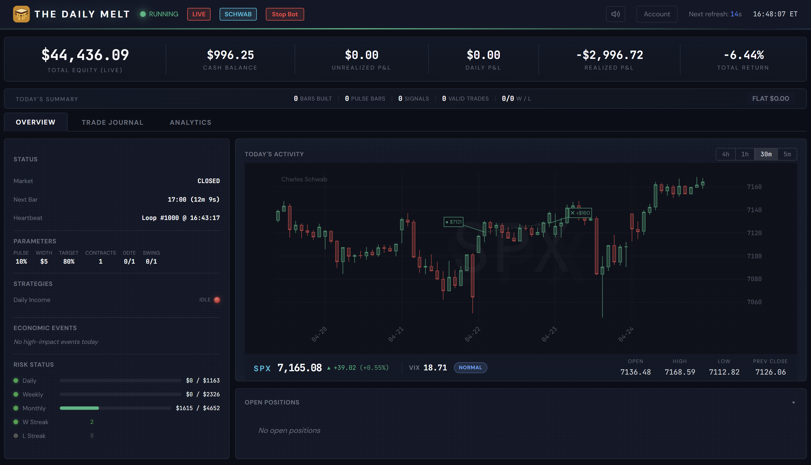

---

### Day 35 — April 27, 2026

**Trade:** No trade — 1 bullish pulse bar detected at 9:30, but the trigger price of $7,166.77 was never hit before the 11:30 window close. Setup expired.
**VIX:** 18.16 (NORMAL regime), SPX opened at 7,152.72 and closed at 7,173.91 (+0.91% from prior close).
**Market context:** 12 bars built. A bullish pulse bar formed on the first bar of the morning, but SPX did not break above the $7,166.77 trigger before the entry window closed at 11:30. Price eventually reached the 7,170s later in the afternoon — too late for the strategy's morning entry window.
**Running record:** 8W/10L (44.4% win rate). Total realized P&L: -$2,996.72 (unchanged).

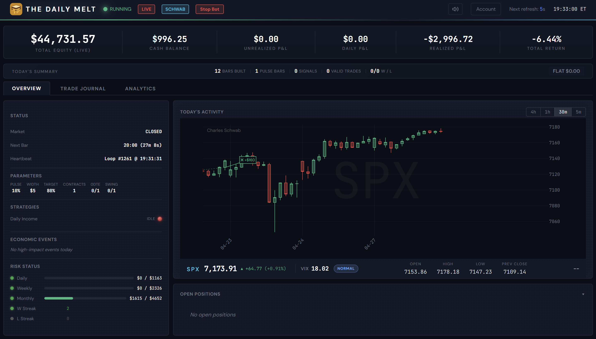

---

### Day 36 — April 28, 2026

**Trade:** No trade — 0 pulse bars detected. 12 bars built, 4 signals evaluated, but none qualified.
**VIX:** 18.0 (NORMAL regime), SPX opened at 7,133.74 and closed at 7,138.80 (+1.06% from prior close).
**Running record:** 8W/10L (44.4% win rate). Total realized P&L: -$2,996.72 (unchanged).

---

### Day 37 — April 29, 2026

**Trade:** Bullish put credit spread 7135/7130 (1 contract), entered 10:12 ET on bullish pulse bar at 9:30. Credit received: $2.15.
**VIX:** 18.07 at entry (NORMAL regime), SPX opened at 7,131.61 (-0.09% gap, essentially flat). Closed at 7,135.95 (+0.06% from prior close).
**Market context:** SPX opened virtually flat and spent most of the day in a tight range. The 9:30 bar formed a bullish pulse and the trigger fired at 10:12 with SPX at 7,132.95. Price barely moved all day — the chart shows a narrow range session. SPX closed at 7,135.95, just above the 7,135 short strike, allowing the put spread to expire worthless for full credit.
**Result:** Win — expired at max profit. Profit captured: 100%. SPX at exit: 7,135.95. The flattest day in the live record at just +0.06% open-to-close.
**Schwab account impact:** +$215.00
**Running record:** 9W/10L (47.4% win rate). Total realized P&L: -$2,781.72. Total return: -5.98%.
**Observation:** Best win of the live validation — full credit captured on a flat, range-bound day. This is exactly the environment where 0DTE credit spreads thrive: low volatility, no gap, no trend.

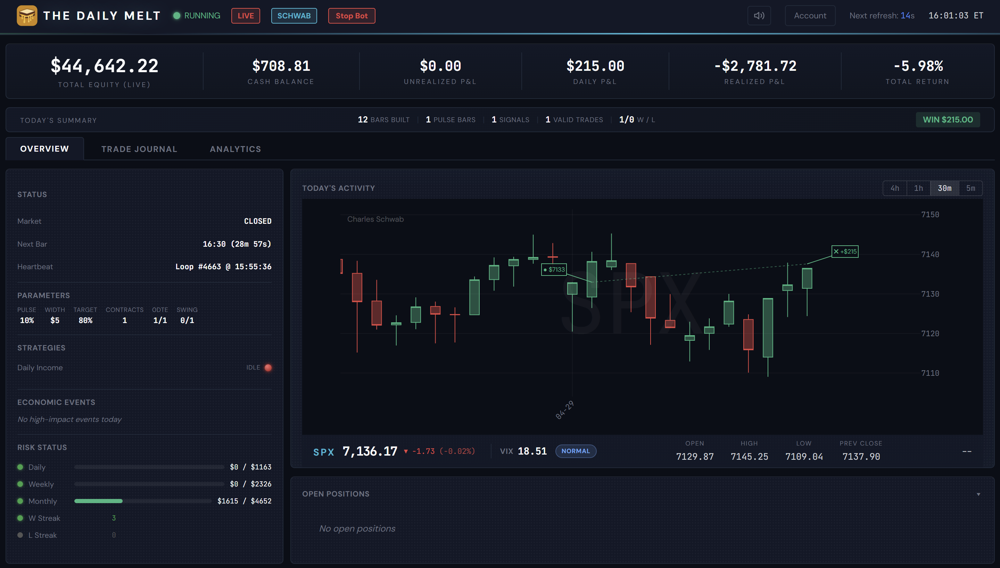

---

### Day 38 — April 30, 2026

**Trade:** Bearish call credit spread 7130/7135 (1 contract), entered 10:08 ET on bearish pulse bar at 9:30. Credit received: $2.70.
**VIX:** 18.08 at entry (NORMAL regime), SPX opened at 7,161.75 (+0.75% gap up). Closed at 7,209.01 (+1.42% from prior close).
**Market context:** GDP and PCE data released pre-market. SPX gapped up +0.75% and the 9:30 bar formed a bearish pulse as the initial gap faded — SPX dropped from the 7,161 open to 7,131 by 10:00, triggering the bearish entry at 7,131.54. However, the selling was short-lived. SPX reversed sharply and rallied throughout the afternoon, closing at 7,209 — nearly 80 points above the entry. The bearish call spread at 7130/7135 was fully in-the-money at expiration.
**Result:** Loss — held to expiration at max loss. SPX closed 79 points above the 7,130 short strike. Profit captured: -85.19%.
**Schwab account impact:** -$230.00
**Running record:** 9W/11L (45.0% win rate). Total realized P&L: -$3,011.72. Total return: -6.47%.
**Observation:** Classic morning gap-fade trap. The bearish pulse bar was triggered by the initial gap-down from the open, but this was a bull trap reversal — the gap faded briefly before the real trend (up) asserted itself. This pattern of gap-induced false pulse bars has been a recurring source of losses.

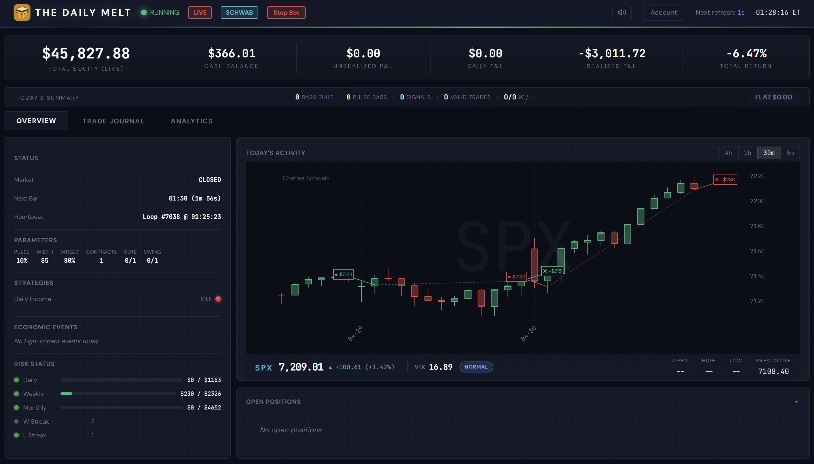

---

### Day 39 — May 1, 2026

**Trade:** Bullish put credit spread 7265/7260 (1 contract), entered 10:00 ET on bullish pulse bar at 9:30. Credit received: $1.85.
**VIX:** 16.70 at entry (NORMAL regime), SPX opened at 7,234.54 (+0.97% gap up). Closed at 7,230.12 (-0.06% from prior close).
**Market context:** SPX gapped up nearly 1% at the open and the 9:30 bar formed a bullish pulse with the close near the high. Entry triggered at 10:00 with SPX at 7,265.49 — right at the short strike. However, the gap-up momentum failed immediately. SPX reversed and sold off steadily through the session, dropping from 7,265 at entry to close at 7,230 — 35 points below the short put strike. The intraday chart shows a clear downtrend after a strong open.
**Result:** Loss — held to expiration at max loss. SPX closed 35 points below the 7,265 short strike. Profit captured: -170.27%.
**Schwab account impact:** -$315.00
**Running record:** 9W/12L (42.9% win rate). Total realized P&L: -$3,326.72. Total return: -7.15%.
**Observation:** Another gap-up reversal loss. The pattern is now clear: large gaps at the open create the appearance of strong momentum (forming pulse bars), but the gap itself often represents the bulk of the move — the intraday session then reverses. This has been the dominant failure mode since early April.

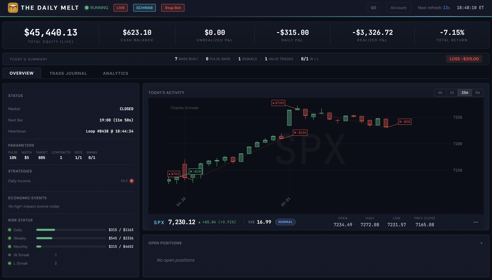

---

### April 2026 Results Summary

**Trades:** 10 | **Win Rate:** 40% (4W/6L) | **P&L:** -$1,150.00 | **Avg Duration:** 5.2h | **Avg Capture:** -32.2%

April was the strategy's worst month. Of the 10 trades, 6 were losses — with most losses coming from two recurring patterns:

1. **Gap-induced false pulse bars:** Large overnight gaps (especially during the early-April recovery rally with 3–4% gaps) created pulse bars that appeared directional but actually represented exhaustion moves. The intraday session frequently reversed the gap direction, causing the trade to lose.
2. **Government/geopolitical headline-driven reversals:** The early April period saw extraordinary market manipulation from tariff announcements and reversals, creating whipsaw price action that the strategy's momentum signals could not distinguish from genuine directional moves.

**All-Time Record (21 trades):** 42.9% win rate, -$3,326.72 P&L, -35.6% avg capture.

**Decision:** Live validation is paused pending strategy adjustments. The core issue is that the pulse bar signal — designed to detect morning momentum — is being triggered by opening gaps rather than genuine intraday momentum. Potential adjustments under consideration include gap-size filters (suppressing signals when the overnight gap exceeds a threshold), requiring intraday confirmation after the gap settles, and recalibrating the pulse bar threshold for different VIX regimes.

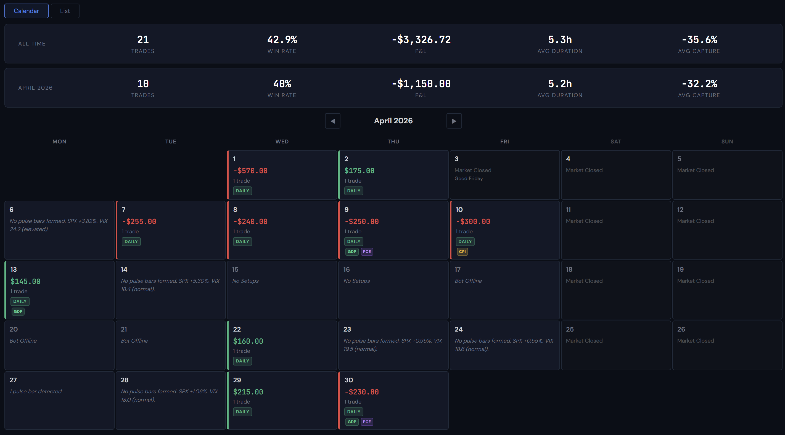

---

## Disclaimer

This is a personal project. It is not financial advice.

- Options trading involves significant risk of loss, including the possibility of losing more than the initial investment
- Past performance, whether simulated or live, does not guarantee future results
- This software is provided as-is with no warranty
- Always validate thoroughly in dry-run mode before risking real capital

---

## License

MIT License - See [LICENSE](LICENSE) for details.
