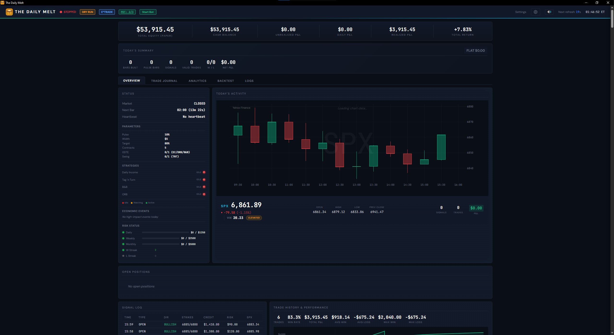
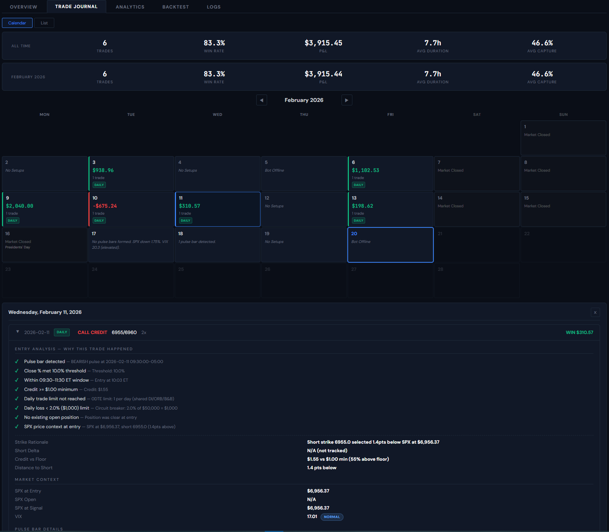
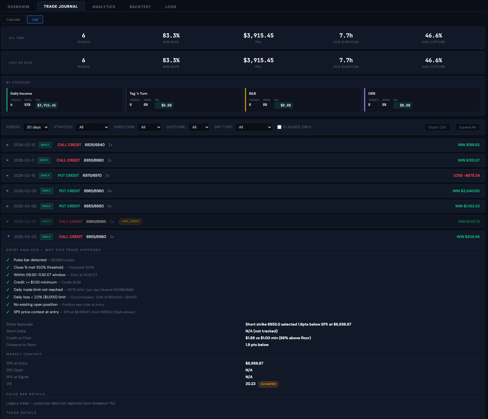
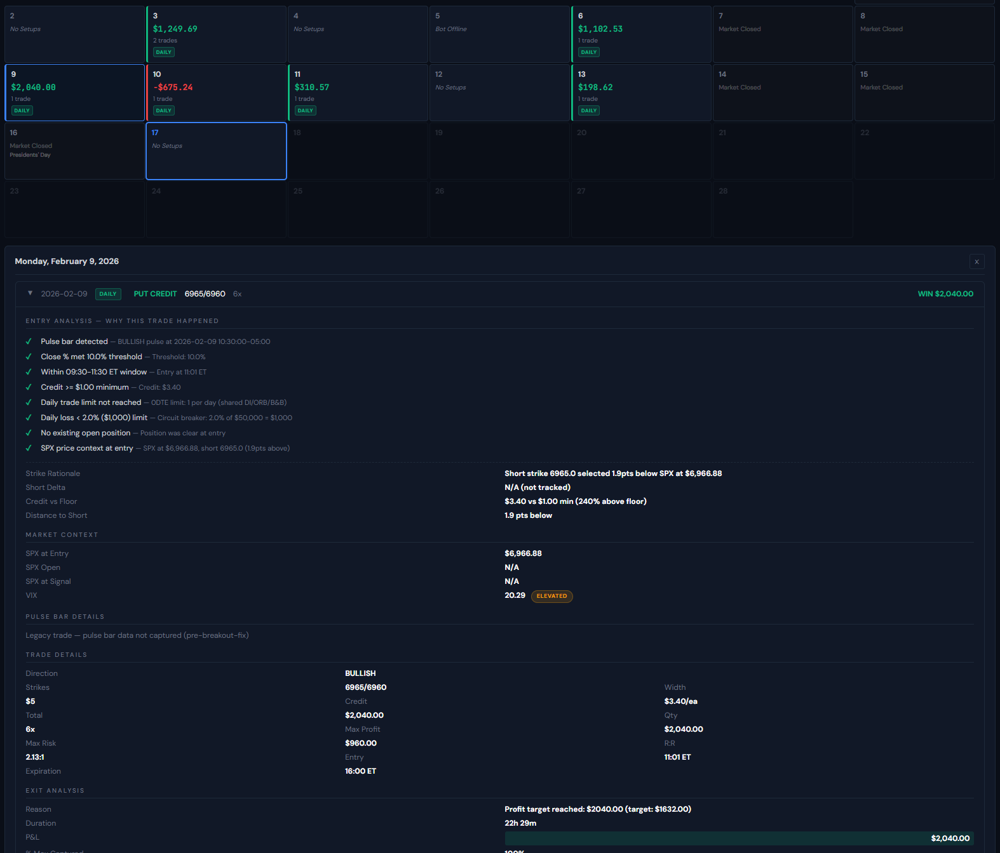
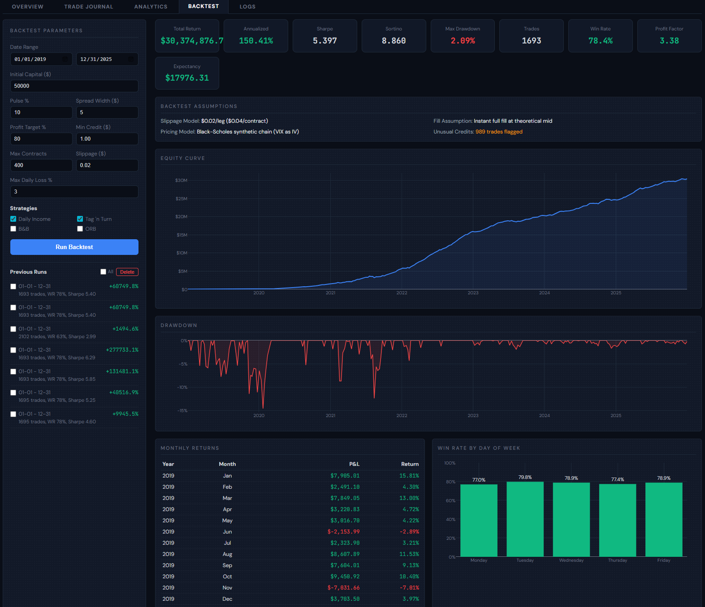
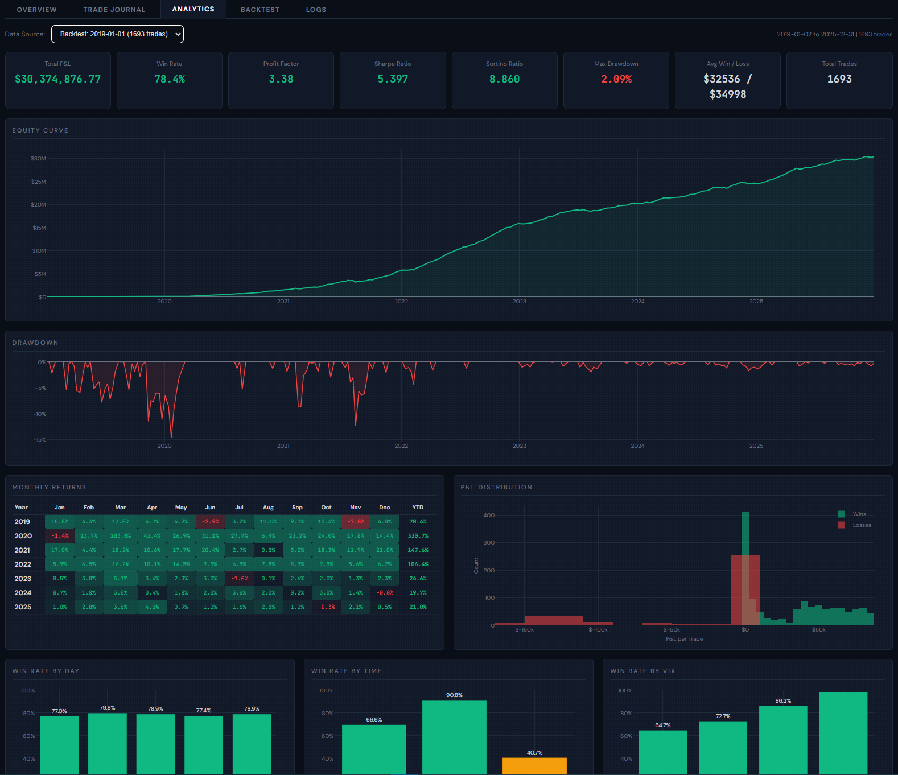
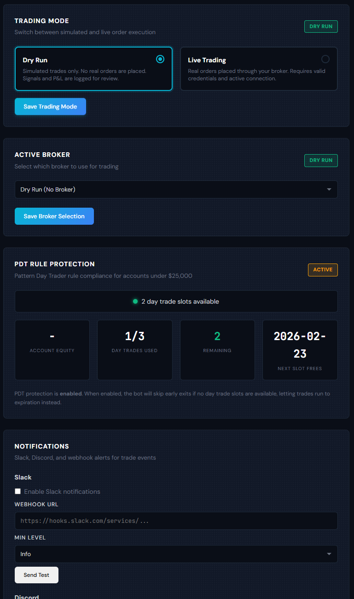
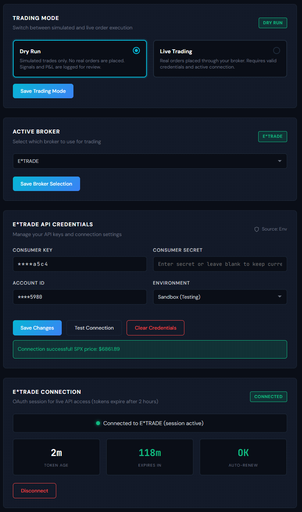

# The Daily Melt

  [](https://opensource.org/licenses/MIT)

Automated SPX 0DTE options income trading system. Runs four parallel credit spread strategies on the S&P 500 index, autonomously from market open to close, with real-time risk management, a web dashboard, full backtesting, and multi-broker support (E*TRADE, Charles Schwab, dry-run simulation). Ships as a standalone desktop app for Windows and macOS.

---

## How It Works

1. **Scan** -- Monitors 30-minute SPX bars for pulse bar momentum patterns (price closing in the top or bottom 10% of the bar's range)
2. **Confirm** -- Waits for price to break the pulse bar's high or low, confirming directional momentum
3. **Execute** -- Enters an ATM credit spread ($5 wide, same-day expiration) in the confirmed direction. Partial fills are accepted and tracked at actual quantity; zero fills are rejected.
4. **Manage** -- Targets 80% of max profit. At 1:00 PM ET, applies trend-based management rules to decide hold vs. close
5. **Repeat** -- Resets daily. No overnight exposure on 0DTE positions

The entire pipeline runs autonomously. The bot handles strike selection, order sizing, execution, monitoring, and exit management across all strategies simultaneously.

---

## Strategies

### Daily Income (DI) -- Core 0DTE
The primary strategy. Detects 30-minute pulse bars during the 9:30-11:30 ET setup window. A pulse bar is one where price closes in the extreme top or bottom 10% of the bar's range, signaling strong directional momentum. After detection, the bot waits for a breakout confirmation (price breaking above the pulse bar high for bullish, below the low for bearish), then enters an ATM credit spread with same-day expiration. Exits at 80% of max profit, via 1 PM management rules, or at expiration.

### Tag 'n Turn (TNT) -- Swing
Bollinger Band mean reversion strategy with 3-7 DTE. Uses a state machine: detects when price tags a Bollinger Band, waits for a pulse bar confirming reversal, then enters on breakout. Targets the opposite Bollinger Band. Holds up to 7 days. Runs in a separate swing slot alongside the 0DTE strategies.

### Bed & Breakfast (B&B) -- Directional Confluence
Detects pulse bars in the 3:00-4:00 PM ET window to generate an overnight directional signal. Only the final bar (15:30) creates a definitive signal; if both the 15:00 and 15:30 bars produce pulses in opposite directions, they cancel out. The signal persists overnight and is used the next morning as directional confluence for DI (informational-only in V1, no independent trade entries). If the market gaps more than 0.3% against the signal direction overnight, the signal is automatically invalidated.

### Opening Range Breakout (ORB)
Uses the first 30-minute bar of the day to define the opening range. Strong signals only: price must close in the top or bottom 10% of the range (weak signals are rejected). A minimum range filter (default 8.0 points) skips narrow, choppy days. When price breaks above the range high or below the range low, a confirmation delay (default 3 minutes) ensures the breakout holds before entry. Managed by DI's exit logic once entered.

### Position Limits
- 2 total position slots: 1 shared 0DTE (DI or ORB) + 1 swing (TNT)
- All strategies share a single daily loss circuit breaker
- DI and ORB share the 0DTE slot (max 1 per day)
- B&B provides directional confluence only (no entries, does not consume a slot)
- TNT uses the swing slot independently (max 1 per day)
- All entry strategies go through the same portfolio risk gates before entry
- Partial fills accepted with actual quantity tracking; zero fills rejected; Slack/Discord notification on partial fills

---

## Features

### Risk Management
- Dynamic position sizing via percent-risk method (scales with account growth)
- Per-strategy max contract overrides for fine-grained sizing control
- Global max contracts ceiling that can never be overridden by strategy-level settings
- 2% daily loss circuit breaker halts all new entries automatically
- Weekly and monthly drawdown limits with configurable thresholds
- Consecutive-loss circuit breaker with configurable pause duration
- Partial fill handling: accepts partial fills at actual quantity, rejects zero fills, sends notification on partial fills
- Credit quality gates reject low-premium setups
- Max position limits enforced across all strategies (2 total: 1 0DTE + 1 swing)
- PDT rule compliance: tracks day trades in a rolling 5-business-day window, blocks entries when slots exhausted (accounts under $25k)
- VIX regime awareness (low / normal / elevated / high / extreme)
- Win/loss streak tracking with frozen previous-streak display

### Broker Integration
- Multi-broker architecture with pluggable broker interface
- **E*TRADE**: Full API integration with OAuth flow, token auto-renewal (90-min cycle), order preview/place/confirm pipeline
- **Charles Schwab**: schwab-py integration with OAuth2 authorization, automatic token refresh, and full options order support
- **Dry-run mode** (default): Real market data via Yahoo Finance with simulated fills using Black-Scholes pricing. No broker credentials needed.
- Reactive 401 handling with automatic token refresh and retry on both brokers
- Proactive token freshness checks before order placement
- Rate limit (429) protection with exponential backoff

### Database Separation
- Dry-run and live trading use separate databases (`trades_dryrun.db` / `trades_live.db`)
- Switching modes shows only trades from that mode
- Backtest results stored in a shared database (mode-independent)
- Schema auto-created on first access for new mode

### Dashboard
- Real-time web UI with account summary, candlestick charts, and position monitoring
- Audio alerts via Web Audio API: market open/close chimes, trade entry/exit tones, bar completion pings, danger alerts (all mutable)
- Signal log showing every detected setup with strikes, credit, risk, and SPX price
- Five tabs: Overview, Trade Journal, Analytics, Backtest, Logs

### Trade Journal
- Two views: monthly calendar and filterable list, toggled with Calendar/List buttons
- Calendar view shows per-day P&L, trade count, strategy tags, no-trade reasons
- List view shows per-strategy summary cards (trades, win rate, P&L) and expandable trade rows
- Entry analysis with pulse bar checklist, strike rationale, market context
- Exit review with post-trade notes and performance rating
- Daily journal capturing bars built, pulse bars, signals evaluated, rejections with reasons
- Filterable by strategy, direction, outcome, day type, and date range
- CSV export for offline analysis

### Analytics
- Data source selector: view analytics for live trades or any historical backtest run
- Sharpe ratio, Sortino ratio, max drawdown, profit factor, expectancy
- Equity curve and drawdown series charts
- Monthly returns heatmap with yearly totals
- P&L distribution histogram
- Win rate breakdowns: by day of week, by time of day, by VIX regime
- Per-strategy trade breakdown (trades, wins, win rate, total P&L)
- Per-direction breakdown (bullish vs. bearish)
- Rolling win rate chart (7-day, 30-day, 90-day moving averages)
- Auto-loads completed backtest results without requiring app restart

### Backtesting
- Historical replay engine supporting all four strategies (DI, TNT, ORB, B&B)
- Strategy selection checkboxes: run any combination of the four strategies
- Automatic SPX and VIX data download from Yahoo Finance
- VIX-aware slippage model: scales with volatility regime ($0.02/leg base, $0.04/leg in elevated+ VIX)
- NYSE half-day calendar: early close days (1 PM ET) handled automatically
- Backtest assumptions panel showing slippage model, pricing model, fill assumptions, and flagged unusual credits
- Configurable parameters: pulse threshold, spread width, profit target, min credit, max contracts, slippage, max daily loss, initial capital
- Position sizing scales with simulated account growth over the backtest period
- Previous runs list with bulk select and delete
- Results auto-populate in the Analytics tab dropdown on completion
- Per-strategy trade breakdown and monthly return heatmaps

### Notifications
- Slack, Discord, and generic webhook integrations
- Email and SMS (Twilio) support
- Configurable notification levels (info, warning, critical)
- Hot-reloadable: changes take effect without restarting the bot (the only hot-reloadable setting)

### Demo Mode
- Record live trading sessions as JSONL event streams
- Replay recordings at accelerated speed (1x / 5x / 10x / 30x / 60x)
- Pre-built demo scenarios: winning day, losing day, no-setup day
- Dashboard looks identical during replay (same API routes, same UI)
- Play/pause, speed control, seek, and jump-to-next-event controls

### Observability
- Structured JSON logging with credential masking
- Prometheus metrics endpoint (`/metrics`) with trade counters, P&L gauges, and latency histograms
- Health endpoint (`/api/health`) for uptime monitoring
- Rotating log files with separate error-level log

### Desktop Application
- Native window via pywebview (not a browser wrapper)
- System tray with bot status indicator (green = running, red = stopped) and minimize-to-tray
- Windows (PyInstaller) and macOS (py2app) builds
- Headless mode (`--headless`) for running without a UI
- Dev mode (`--dev`) opens in system browser

### Data & Storage
- SQLite database with WAL mode for concurrent read/write access
- Separate databases for dry-run and live trading modes
- OS keychain credential storage (Windows Credential Manager / macOS Keychain / Linux Secret Service)
- Automatic database migrations on startup
- Signal log rotation at 5,000 entries with atomic writes (tempfile + rename)
- CSRF protection via per-session API token on all state-changing requests

---

## Screenshots

**Dashboard Overview** -- Bot status, strategy parameters, risk drawdown meters, SPX candlestick chart with pulse bar highlights, account summary, signal log, and trade history.



**Trade Journal - Calendar View** -- Monthly calendar showing per-day P&L, trade count, strategy tags, no-trade reasons, weekends, and market holidays. Click any day to expand its trades with full entry analysis below.



**Trade Journal - List View** -- Per-strategy summary cards, filterable trade list with expandable entry/exit analysis, CSV export. Filter by strategy, direction, outcome, day type, and date range.



**Trade Journal - Trade Detail** -- Entry analysis with a checklist of every gate the signal passed through, pulse bar details, strike rationale, market context, trade details (strikes, credit, risk/reward, duration), and exit analysis with post-trade review.



**Backtest** -- Parameter configuration, strategy selection, previous runs with bulk delete, equity curve, drawdown chart, monthly returns table, win rate by day of week, and backtest assumptions panel.



**Analytics** -- Data source selector (live or backtest), equity curve, drawdown, monthly returns heatmap, P&L distribution, win rate by day/time/VIX regime. Works with both live trades and historical backtest results.



**Settings - Dry Run** -- Trading mode toggle, broker selection, PDT rule protection status, and notification configuration.



**Settings - E*TRADE** -- Broker credential management with masked display, connection testing, OAuth session status with token age and auto-renewal.



---

## Architecture

```
Market Data (Yahoo Finance)
    |
    v
BarBuilder (30-min aggregation)
    |
    v
Strategy Engine
    |--- Daily Income (0DTE credit spreads, pulse bar + breakout)
    |--- Tag 'n Turn (BB mean reversion, 3-7 DTE swing)
    |--- Bed & Breakfast (directional confluence signal for DI)
    |--- Opening Range Breakout (strong-only, range filter, confirmation delay)
    |
    v
Portfolio Manager (2-slot limits, risk gates, circuit breaker, PDT gate)
    |
    v
Broker Interface
    |--- E*TRADE Broker (live orders via OAuth API)
    |--- Schwab Broker (live orders via schwab-py OAuth2)
    |--- Dry-Run Broker (real data, simulated fills via Black-Scholes)
    |
    v
Position Manager (P&L tracking, exit management, partial fill tracking, 1pm check)
    |
    +---> SQLite Database (mode-specific: dry-run / live)
    +---> Flask Dashboard (Overview, Journal, Analytics, Backtest, Logs)
    +---> Notification Manager (Slack, Discord, email, SMS, webhooks)
    +---> Prometheus Metrics (/metrics)
    +---> Event Recorder (demo JSONL capture)
```

**Tech stack:** Python 3.13, Flask, SQLite (WAL), Yahoo Finance, E*TRADE API, schwab-py, pywebview, PyInstaller/py2app, Prometheus

---

## Settings

All settings are configured via `config/strategy_params.yaml` and the dashboard Settings page.

### What requires a restart
- Trading mode (dry-run / live)
- Active broker (schwab / etrade / dry_run)
- Strategy enable/disable flags (DI, TNT, B&B, ORB)
- Pulse threshold, spread width, profit target
- Position sizing parameters (max contracts, risk per trade)
- Drawdown limits (daily, weekly, monthly)
- Setup window timing (morning start/end, afternoon window)
- Bollinger Band filter parameters
- PDT protection settings
- ORB range filter and confirmation delay
- B&B gap invalidation threshold

### What is hot-reloadable (no restart needed)
- Notification settings (Slack, Discord, webhooks, email, SMS)

### Key parameters

| Parameter | Default | Description |
|-----------|---------|-------------|
| `strategy.pulse_threshold` | 10% | How extreme the bar close must be (top/bottom N%) |
| `strategy.spread_width` | $5 | Width of credit spreads |
| `strategy.profit_target_pct` | 80% | Exit when this percentage of max profit is reached |
| `portfolio.max_daily_loss_pct` | 2% | Circuit breaker: halt all entries for the day |
| `portfolio.position_sizing.max_contracts` | 20 | Global max contracts per trade (set to 1 for small accounts) |
| `portfolio.position_sizing.risk_per_trade_pct` | 2% | Account percentage risked per trade |
| `timing.morning_start` | 09:30 | Setup window open |
| `timing.morning_end` | 11:30 | Setup window close |
| `tag_n_turn.spread_width` | $10 | TNT spread width (wider for swing trades) |
| `tag_n_turn.min_dte` / `max_dte` | 3 / 7 | TNT expiration range |
| `orb.min_range_points` | 8.0 | Minimum opening range size in points (skip narrow days) |
| `orb.confirmation_minutes` | 3 | Minutes a breakout must hold before entry |
| `bnb.gap_invalidation_pct` | 0.3% | Overnight gap threshold that invalidates B&B signal |

---

## Quick Start

```bash
# Clone and install
git clone https://github.com/ccharafeddine/spx-income-trader.git
cd spx-income-trader
pip install -r requirements.txt

# Run in dry-run mode (real market data, simulated execution)
python src/main.py

# Or launch the desktop app
python app_desktop.py

# Pre-built desktop app (if available)
# Windows: dist/The Daily Melt/The Daily Melt.exe
# macOS:   dist/The Daily Melt.app
```

**Broker Setup:**

- **Schwab**: Launch the app, go to Settings, enter your Schwab API credentials, and complete the OAuth2 flow. The bot handles token refresh automatically. Set `broker.active: schwab` in `strategy_params.yaml`.
- **E*TRADE**: Configure your consumer key and secret via the Settings page or OS keychain. OAuth token renewal runs on a 90-minute cycle. Set `broker.active: etrade`.
- **Dry Run** (default): No broker config needed. Uses real market data with simulated fills.

**Configuration:**
- `config/strategy_params.yaml` for strategy parameters (thresholds, spread width, profit target, timing windows, broker selection)
- Dashboard Settings page for credentials, trading mode (dry-run/live), and notifications
- Credentials stored in OS keychain, never in config files

---

## Building from Source

Requires **Python 3.13** (pythonnet does not support 3.14+).

**Windows (PyInstaller):**

```bash
py -3.13 -m venv .venv313
.venv313\Scripts\activate
pip install -r requirements.txt

# Build (output: dist/The Daily Melt/)
python build/build_windows.py --clean

# Debug build with console visible
python build/build_windows.py --clean --debug
```

**macOS (py2app):**

```bash
python3.13 -m venv .venv313
source .venv313/bin/activate
pip install -r requirements.txt

# Build (output: dist/The Daily Melt.app)
python build/build_macos.py --clean
```

**Packaged app data paths:**
- Windows: `%LOCALAPPDATA%\SPXIncomeTrader\SPXIncomeTrader\`
- macOS: `~/Library/Application Support/SPXIncomeTrader/`

The packaged app copies the database and seeds `strategy_params.yaml` on first run.

---

## Project Structure

```
src/
    main.py                  # TradingBot orchestrator and main loop
    core/
        strategy.py          # Daily Income strategy (pulse bar + breakout)
        tag_n_turn.py        # Tag 'n Turn swing strategy (BB reversals)
        bnb_strategy.py      # B&B directional confluence signal
        orb_strategy.py      # Opening Range Breakout strategy
        portfolio_manager.py # Multi-strategy coordination and risk gates
        position_manager.py  # Trade lifecycle, P&L, exit management
        bar_builder.py       # 30-min bar aggregation from tick data
        pulse_detector.py    # Pulse bar pattern detection
        bollinger_filter.py  # Bollinger Band filter and trend bias
        pdt_tracker.py       # Pattern Day Trader rule tracking
        drawdown_manager.py  # Drawdown tracking and circuit breakers
    data/
        yahoo_finance.py     # Real-time SPX/VIX quotes
        market_data.py       # Market data abstraction
        vix_provider.py      # VIX data with multi-source fallback
    brokers/
        base.py              # Abstract broker interface
        broker_factory.py    # Broker selection and instantiation
        etrade_broker.py     # E*TRADE live trading (OAuth, orders)
        etrade_auth.py       # E*TRADE OAuth token management
        schwab_broker.py     # Schwab live trading (schwab-py)
        schwab_auth.py       # Schwab OAuth2 token management
        dry_run_broker.py    # Simulated execution with real data
    backtest/
        engine.py            # Multi-strategy backtest engine
        runner.py            # CLI backtest runner
        data_loader.py       # Yahoo Finance data download and CSV parsing
        sim_broker.py        # Simulated broker for backtesting
        report.py            # Backtest report generation
    demo/
        recorder.py          # JSONL event recorder for live sessions
        replay.py            # Replay engine with threaded playback
    models/
        bar.py               # Bar dataclass
        spread.py            # CreditSpread, OptionLeg models
        trade.py             # Trade record, TradeStatus enum
    utils/
        app_paths.py         # Cross-platform path resolution
        logging.py           # Structured logging with credential masking
        metrics.py           # Prometheus metrics
        notifications.py     # Slack, Discord, email, SMS, webhooks
        version.py           # Version management

dashboard/
    app.py                   # Flask REST API and dashboard server
    templates/
        index.html           # Main dashboard (5 tabs)
        settings.html        # Configuration UI
        setup.html           # Initial setup wizard

config/
    strategy_params.yaml     # All strategy and risk parameters
    settings.py              # Environment, paths, DB config

database/
    db_manager.py            # SQLite operations (WAL mode, migrations)
    schema.sql               # Database schema (53 columns)
    demo_recordings/         # Pre-built demo JSONL files

scripts/
    generate_demo_recording.py  # Fabricate demo scenarios
    run_dashboard.py            # Run dashboard standalone
    run_dry_run.py              # Quick-start dry-run mode
    validate_schwab.py          # Schwab credential validation
    health_check.py             # Health check script
    view_trades.py              # Trade database viewer

build/
    build_windows.py         # PyInstaller build script (Windows)
    build_macos.py           # py2app build script (macOS)

app_desktop.py               # Desktop app entry point (pywebview + Flask)
```

---

## Testing

610 tests covering:
- Strategy logic (pulse detection, breakout confirmation, setup windows, range filters, confirmation delays)
- Multi-strategy backtest engine (DI, TNT, ORB, B&B parallel execution)
- Position management (sizing, P&L calculation, exit triggers, partial fill tracking)
- Risk gates (circuit breaker, position limits, credit quality, drawdown)
- Catastrophic scenario testing (max_contracts enforcement, B&B entry prevention, circuit breaker all-path coverage)
- PDT compliance tracking and entry gating
- Bar building and market state management
- Consecutive loss tracking and streak counters
- VIX data provider multi-source fallback chains
- Daily journal persistence and API endpoints
- Notification delivery (Slack, Discord, email, webhook)
- Demo mode (recording, replay, Flask integration)
- Monitoring and observability (Prometheus metrics, health endpoint)
- Schwab and E*TRADE broker integration
- Slippage tracking and database migrations
- Database separation (dry-run vs live mode)

```bash
python -m pytest tests/ -v
```

CI runs on every push and pull request to `main`, testing Python 3.11, 3.12, and 3.13.

---

## Backtesting

Run backtests from the dashboard Backtest tab or via CLI:

```bash
python -m src.backtest.runner --start 2024-01-01 --end 2025-12-31

# With custom parameters
python -m src.backtest.runner \
    --start 2024-06-01 \
    --end 2025-06-01 \
    --capital 100000 \
    --pulse-threshold 10 \
    --spread-width 5 \
    --profit-target 80 \
    --max-contracts 5 \
    --slippage 0.02 \
    --output docs/backtest_report.md
```

The dashboard Backtest tab provides:
- Strategy selection checkboxes (any combination of DI, TNT, B&B, ORB)
- All parameters configurable in-UI
- Progress bar with current date indicator
- Results display with equity curve, drawdown, and monthly returns
- Backtest assumptions panel (slippage model, pricing model, fill assumptions, flagged unusual credits)
- Previous runs list with bulk select and delete
- Completed backtests auto-appear in the Analytics tab dropdown
- VIX-aware slippage: base $0.02/leg, elevated to $0.04/leg in high-VIX regimes
- NYSE half-day calendar: early close days handled automatically

SPX and VIX data are downloaded automatically from Yahoo Finance. Pass `--csv` and `--vix-csv` to use existing data files.

---

## Demo Mode

Generate synthetic demo recordings and replay them through the dashboard:

```bash
# Generate all three demo scenarios
python scripts/generate_demo_recording.py --all

# Launch the desktop app in demo mode
python app_desktop.py --demo database/demo_recordings/demo_winning.jsonl
```

Three pre-built scenarios:
- **Winning day**: Bullish pulse, breakout confirmed, put spread entered, 80% profit target hit
- **Losing day**: Bullish pulse, breakout, reversal, stop loss hit
- **No-setup day**: Narrow range, no pulse detected, all windows expire

---

## Disclaimer

This is a personal project. It is not financial advice.

- Options trading involves significant risk of loss, including the possibility of losing more than the initial investment
- Past performance, whether simulated or live, does not guarantee future results
- This software is provided as-is with no warranty
- Always validate thoroughly in dry-run mode before risking real capital

---

## License

MIT License - See [LICENSE](LICENSE) for details.
